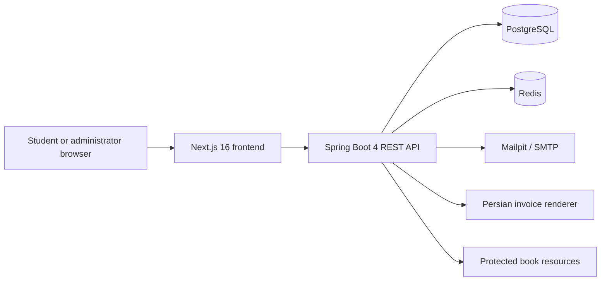
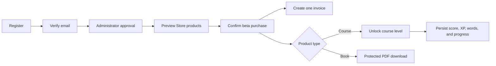

<div align="center">

# ENAcademy

### A bilingual, production-shaped English learning platform

Learn, manage, purchase, and track progress through one complete Spring and Next.js application.

[](https://github.com/Kourosh-MD/enacademy-learning/actions/workflows/ci.yml)


</div>

## What is ENAcademy?

ENAcademy is a full-stack learning platform built to demonstrate how a real web application fits together: a polished bilingual interface, secure account lifecycle, administrator-controlled enrollment, persistent learning progress, digital products, protected downloads, and database-backed invoices.

The project currently delivers a complete A1–A2 English path. It is designed as a serious portfolio and open-source foundation rather than a static landing-page demo.

## Highlights

| Area | What ENAcademy provides |
|---|---|
| Learning | Structured A1–A2 curriculum, interactive activities, sequential lessons, scoring, XP, saved vocabulary, and durable progress |
| Accounts | Student registration, email verification, secure login, refresh tokens, rate limiting, and administrator approval |
| Commerce | Course and book previews, toman pricing, instant beta checkout, automatic course unlocking, and protected book downloads |
| Invoices | One uniquely numbered invoice per purchase with item names, quantities, prices, totals, customer details, Persian digits, and a Jalali date |
| Administration | Student approval and suspension, platform metrics, audit visibility, product availability, prices, orders, and invoice access |
| Experience | Responsive English/Persian UI, RTL support, professional local fonts, light/dark themes, selectable accent colors, and 3D landing-page motion |
| Operations | Docker Compose, health checks, Flyway migrations, Mailpit email testing, start/stop scripts, and GitHub Actions quality gates |

> **Beta commerce notice:** purchases are approved immediately for demonstration. ENAcademy does not contact an Iranian payment gateway and does not collect or store banking/card information.

## Architecture



- **Next.js** owns the responsive bilingual experience and authenticated workspaces.
- **Spring Boot** owns validation, security, workflows, authorization, and business rules.
- **PostgreSQL** is the source of truth for users, learning progress, catalog data, purchases, invoices, entitlements, and audits.
- **Redis** provides disposable rate-limit state without becoming a system of record.
- **Docker Compose** gives every developer the same reproducible runtime.

## Student journey



Every checkout is atomic: ENAcademy creates the approved order, immutable item snapshots, one invoice, and all related entitlements together. If any operation fails, PostgreSQL rolls back the complete purchase.

## Quick start

### Requirements

- Docker Engine
- Docker Compose v2

### Start

```bash
./start-app.sh
```

The script builds the images, starts PostgreSQL, Redis, Mailpit, the Spring API, and the Next.js frontend, then waits for the services to become healthy.

Open:

| Service | Address |
|---|---|
| ENAcademy | http://localhost:3000 |
| API documentation | http://localhost:8080/docs |
| Mailpit inbox | http://localhost:8025 |
| Health endpoint | http://localhost:8080/actuator/health |

### Stop

```bash
./stop-app.sh
```

Stopping the stack does not delete PostgreSQL data. Copy `.env.example` to `.env` when you need custom local credentials, and replace all example secrets before any external deployment.

## Account workflow

1. Create a student account.
2. Open Mailpit and follow the one-time verification link.
3. Sign in as the administrator configured by `APP_ADMIN_EMAIL` and `APP_ADMIN_PASSWORD`.
4. Approve the verified student.
5. The student can sign in, use the Store, obtain course/book access, and continue learning.

## Technology choices

| Technology | Why it is used |
|---|---|
| Java 21 + Spring Boot 4 | Strong typing, mature security, transactions, validation, testing, and maintainable domain services |
| Next.js 16 + React 19 + TypeScript | Modern routing, component-driven UI, type safety, performance, and production builds |
| PostgreSQL | Reliable relational constraints and ACID transactions for identities, progress, purchases, invoices, and entitlements |
| Redis | Fast expiring counters for login protection without polluting permanent data |
| Flyway | Versioned, repeatable database evolution instead of uncontrolled automatic schema changes |
| Docker Compose | One-command reproducible development and deployment-shaped environments |
| Mailpit | Safe local inspection of verification email without sending real messages |
| GitHub Actions | Independent backend, frontend, and container checks for every pushed change and pull request |

## Repository map

```text
frontend/                  Next.js application and automated UI regressions
backend/                   Spring Boot API, tests, Flyway migrations, fonts, and protected books
docs/system-guide.md       Complete architecture, workflows, diagrams, decisions, security, and operations
docs/database.md           Database tables, relationships, persistence, backups, and inspection
docs/architecture.md       Focused architecture summary
docs/security.md           Security model and production checklist
scripts/                   Curriculum export and deterministic demo-book generation
docker-compose.yml         Full local platform topology
start-app.sh / stop-app.sh Friendly lifecycle commands
```

## Documentation

- [Complete system guide](docs/system-guide.md) — all product workflows, system diagrams, APIs, data relationships, trust boundaries, technical decisions, and operations
- [Database guide](docs/database.md) — what is stored, where it lives, how tables relate, and how to inspect or back it up
- [Architecture](docs/architecture.md) — concise component and deployment view
- [Security](docs/security.md) — authentication, authorization, secrets, headers, and deployment checklist
- [Contributing](CONTRIBUTING.md) — local workflow and quality expectations

## Development

Start only the supporting infrastructure:

```bash
docker compose up postgres redis mailpit
```

Run the backend:

```bash
cd backend
./mvnw spring-boot:run
```

Run the frontend in another terminal:

```bash
cd frontend
npm ci
npm run dev
```

## Quality gates

```bash
make test
docker compose config --quiet
docker compose build
```

GitHub Actions independently runs the Spring tests, frontend regression tests, lint, TypeScript checks, production build, Compose validation, and container image builds.

## Project status

ENAcademy is an actively developed portfolio and future open-source project. Its commerce workflow is intentionally simulated; production payments, tax compliance, refunds, object storage, observability, backups, and deployment hardening remain explicit future work.
