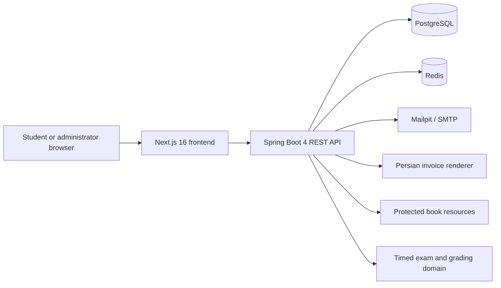
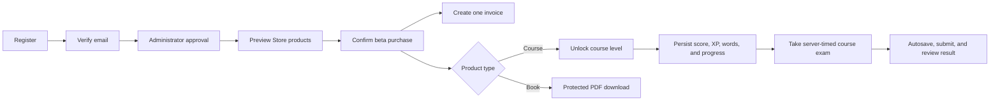

<div align="center">

# ENAcademy

### A bilingual, production-shaped English learning platform

Learn, take timed exams, manage, purchase, and track progress through one complete Spring and Next.js application.

[](https://github.com/Kourosh-MD/enacademy-learning/actions/workflows/ci.yml)


</div>

## What is ENAcademy?

ENAcademy is a full-stack learning platform built to demonstrate how a real web application fits together: a polished bilingual interface, secure account lifecycle, administrator-controlled enrollment, persistent learning progress, digital products, protected downloads, and database-backed invoices.

The project currently delivers a complete A1–A2 English path. It is designed as a serious portfolio and open-source foundation rather than a static landing-page demo.

## Highlights

| Area | What ENAcademy provides |
|---|---|
| Learning | Structured A1–A2 curriculum, interactive activities, sequential lessons, scoring, XP, saved vocabulary, and durable progress |
| Online exams | Bilingual timed A1/A2 exams, server-enforced deadlines, automatic batch saving, resume support, immediate grading/review, and administrator scheduling/monitoring |
| Accounts | Student registration, verification resend, one-time password reset, secure login, rotating refresh tokens, rate limiting, and administrator approval |
| Commerce | Course and book previews, toman pricing, instant beta checkout, automatic course unlocking, and protected book downloads |
| Invoices | One uniquely numbered invoice per purchase with item names, quantities, prices, totals, customer details, Persian digits, and a Jalali date |
| Administration | Student approval and suspension, platform metrics, audit visibility, product availability, prices, orders, and invoice access |
| Experience | Responsive English/Persian UI, RTL support, professional local fonts, light/dark themes, selectable accent colors, and 3D landing-page motion |
| Operations | Docker Compose, health checks, bounded pools, Flyway, scheduled token cleanup, structured request-correlated logs, Mailpit, start/stop scripts, a reproducible 100-user exam load test, and browser-tested GitHub Actions gates |

> **Beta commerce notice:** purchases are approved immediately for demonstration. ENAcademy does not contact an Iranian payment gateway and does not collect or store banking/card information.

## Architecture



- **Next.js** owns the responsive bilingual experience and authenticated workspaces.
- **Spring Boot** owns validation, security, workflows, authorization, and business rules.
- **PostgreSQL** is the source of truth for users, learning progress, catalog data, purchases, invoices, entitlements, and audits.
- **Redis** provides disposable rate-limit state without becoming a system of record.
- **Docker Compose** gives every developer the same reproducible runtime.

## Student journey



Every checkout is atomic: ENAcademy creates the approved order, immutable item snapshots, one invoice, and all related entitlements together. If any operation fails, PostgreSQL rolls back the complete purchase.

## Quick start

### Requirements

- Docker Engine
- Docker Compose v2

### Start

```bash
./start-app.sh
```

The script builds the images, starts PostgreSQL, Redis, Mailpit, the Spring API, and the Next.js frontend, then waits for the services to become healthy.

Open:

| Service | Address |
|---|---|
| ENAcademy | http://localhost:3000 |
| API documentation | http://localhost:8080/docs |
| Mailpit inbox | http://localhost:8025 |
| Health endpoint | http://localhost:8080/actuator/health |

### Stop

```bash
./stop-app.sh
```

Stopping the stack does not delete PostgreSQL data. Copy `.env.example` to `.env` when you need custom local credentials, and replace all example secrets before any external deployment.

## Account workflow

1. Create a student account.
2. Open Mailpit and follow the one-time verification link.
3. Sign in as the administrator configured by `APP_ADMIN_EMAIL` and `APP_ADMIN_PASSWORD`.
4. Approve the verified student.
5. The student can sign in, use the Store, obtain course/book access, and continue learning.
6. The purchased course also unlocks its online exam; answers autosave and the server produces the final score.

If the original verification message is lost, the student can request a fresh link without revealing whether arbitrary addresses have accounts. The sign-in screen also provides a one-time password-reset flow; completing it revokes every existing refresh session for that account.

## Online exam capacity

The exam workflow is engineered for a target of 100 simultaneous students. Attempt creation and submission are idempotent, timers are durable, saves use one batched PostgreSQL upsert, hot paths are indexed, and Spring uses bounded Hikari/Tomcat pools so a request spike cannot create an unbounded database-connection spike.

Run the complete 100-user login and exam proof on a disposable local or staging environment:

```bash
./start-app.sh
./scripts/exam-load-test.sh
```

The report prints p50/p95/max latency and fails if any learner cannot login, start/resume, save, or finalize. Hardware still matters; see [Online exams and 100-user capacity](docs/exam-capacity.md) for sizing assumptions, acceptance criteria, exact optimizations, and limitations.

## Technology choices

| Technology | Why it is used |
|---|---|
| Java 21 + Spring Boot 4 | Strong typing, mature security, transactions, validation, testing, and maintainable domain services |
| Next.js 16 + React 19 + TypeScript | Modern routing, component-driven UI, type safety, performance, and production builds |
| PostgreSQL | Reliable relational constraints and ACID transactions for identities, progress, purchases, invoices, and entitlements |
| Redis | Fast expiring counters for login protection without polluting permanent data |
| Flyway | Versioned, repeatable database evolution instead of uncontrolled automatic schema changes |
| Docker Compose | One-command reproducible development and deployment-shaped environments |
| Mailpit | Safe local inspection of verification and password-reset email without sending real messages |
| Playwright | Exercises the complete registration, approval, login, recovery, purchase, completion, and suspension path in a real Chromium browser |
| GitHub Actions | Independent backend/frontend checks followed by a production-like Compose and browser workflow on every push or pull request |

## Repository map

```text
frontend/                  Next.js application and automated UI regressions
backend/                   Spring Boot API, tests, Flyway migrations, fonts, and protected books
docs/system-guide.md       Complete architecture, workflows, diagrams, decisions, security, and operations
docs/database.md           Database tables, relationships, persistence, backups, and inspection
docs/architecture.md       Focused architecture summary
docs/security.md           Security model and production checklist
docs/exam-capacity.md      Online-exam workflow, concurrency design, tuning, and 100-user proof
scripts/                   Curriculum/books plus isolated exam load fixture and runner
docker-compose.yml         Full local platform topology
start-app.sh / stop-app.sh Friendly lifecycle commands
```

## Documentation

- [Complete system and teaching guide](docs/system-guide.md) — all product workflows, diagrams, APIs, tokens, themes, data, security, decisions, and operations, followed by a guided lesson and exercises for each of its 20 major topics
- [Platform tools teaching guide](docs/platform-tools-guide.md) — practical lessons for Swagger/OpenAPI, Actuator, Flyway, PostgreSQL, Redis, Mailpit, JWT, Docker, testing, CI, browser APIs, and observability
- [Database guide](docs/database.md) — what is stored, where it lives, how tables relate, and how to inspect or back it up
- [Architecture](docs/architecture.md) — concise component and deployment view
- [Security](docs/security.md) — authentication, authorization, secrets, headers, and deployment checklist
- [Online exams and 100-user capacity](docs/exam-capacity.md) — timed workflow, concurrency guarantees, runtime tuning, load-test commands, acceptance criteria, and limits
- [Contributing](CONTRIBUTING.md) — local workflow and quality expectations

## Development

Start only the supporting infrastructure:

```bash
docker compose up postgres redis mailpit
```

Run the backend:

```bash
cd backend
./mvnw spring-boot:run
```

Run the frontend in another terminal:

```bash
cd frontend
npm ci
npm run dev
```

## Quality gates

```bash
make test
docker compose config --quiet
docker compose build
```

GitHub Actions independently runs Spring integration tests, frontend regression tests, lint, TypeScript checks, the production build, then starts the complete Compose platform and executes the Playwright lifecycle test in Chromium.

## Project status

ENAcademy is an actively developed portfolio and future open-source project. Its commerce workflow is intentionally simulated. The online-exam code and repeatable 100-user harness provide a measurable capacity target, not a hardware-independent guarantee. HTTPS deployment is intentionally not configured because no domain/host has been selected; production payments, tax compliance, refunds, proctoring, high availability, object storage, central monitoring, backups, and deployment-specific hardening remain future work.

---

## Implementation record — what we added

This additive record preserves the project introduction above and summarizes the major platform work completed during the current development phase.

### Product capabilities delivered

- Rebuilt ENAcademy as a real Spring Boot, Next.js, PostgreSQL, Redis, and Docker Compose web application.
- Added student registration, email verification, administrator approval, login, rotating sessions, suspension, and account recovery.
- Added a persistent learning journey with ordered lessons, progress, XP, saved vocabulary, browser listening, and speaking practice.
- Added English/Persian interface switching, RTL support, improved bilingual fonts, light/dark modes, and selectable color palettes.
- Added a simulated toman store for courses and downloadable books, automatic entitlements, purchase history, and a Persian PDF invoice for every checkout.
- Added database-backed timed online exams with autosave, server-side grading, results, admin scheduling, and a repeatable 100-student load-test harness.
- Added Docker start/stop scripts, health checks, database migrations, structured logs, API documentation, tests, and GitHub Actions quality gates.

### The eight hardening items

| # | Requested item | Status | Result |
|---:|---|---|---|
| 1 | Replace all development secrets | Skipped by request | Example/local defaults remain development-only and must be replaced before public production. |
| 2 | Deploy behind HTTPS | Postponed | A real host and domain must be selected before configuring trusted TLS termination and secure cookies. |
| 3 | Add CSP and security headers | Implemented | Next.js uses a per-request CSP nonce; Next.js and Spring send browser/API security headers. |
| 4 | Add password reset and verification resend | Implemented | Neutral request responses, one-time hashed tokens, email links, throttling, and refresh-session revocation are in place. |
| 5 | Add scheduled token cleanup | Implemented | A configurable daily job removes expired tokens and old consumed/revoked token rows. |
| 6 | Add structured logs and request correlation | Implemented | Requests receive `X-Request-ID`; safe structured logs and ProblemDetail responses share that identifier. |
| 7 | Add end-to-end workflow tests | Implemented | Playwright covers registration, verification resend, approval, login, reset, purchase, invoice, lesson completion, and suspension. |
| 8 | Add dependency, secret, and image scanning | Skipped by request | These scanners are not configured and remain a future production/open-source task. |

### Verification and delivery

The completed work passed Maven backend checks, frontend lint/type-check/build, 22 frontend source tests, Docker Compose validation, production image builds, local Chrome end-to-end testing, and the same full-stack Playwright lifecycle in GitHub Actions. The application and documentation were separated into genuine reviewable pull requests so `main` was never overwritten directly.

For the detailed explanation, continue with the [complete system and teaching guide](docs/system-guide.md), [architecture record](docs/architecture.md), [database record](docs/database.md), [security record](docs/security.md), and [exam-capacity record](docs/exam-capacity.md).
