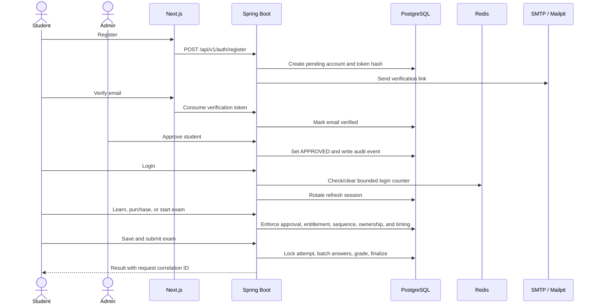

# Architecture

## Boundaries

The browser talks to Next.js on one origin. Next.js proxies `/api/*` to Spring Boot, which owns identity, authorization, business rules, and persistence.

```text
Browser -> Next.js -> Spring Boot -> PostgreSQL
                              |--> Redis
                              `--> SMTP / Mailpit
```

- PostgreSQL is the source of truth for accounts, tokens, lessons, progress, timed exams, answers, results, products, invoices, entitlements, saved words, and audits.
- Redis contains disposable rate-limit counters only. Authentication continues if Redis is restarting.
- Mailpit captures development email. Production can use any SMTP provider through environment variables.
- Flyway is the only schema migration mechanism; Hibernate automatic DDL is disabled so the application never mutates the schema implicitly.

## Identity lifecycle

Student access is deliberately two-stage: `email_verified_at` proves mailbox control, while `status` records the administrator decision. Only an email-verified `APPROVED` account can access learning APIs.

The backend assigns `STUDENT` or `ADMIN`; the client never supplies a role. The initial administrator is idempotently bootstrapped from environment variables.

Students can request a fresh verification message or a one-time password-reset link. Both request endpoints return neutral responses to prevent account discovery and use independent Redis limits. Resetting a password revokes every refresh session for the account.

## Session design

- Access tokens are 15-minute signed JWTs kept only in browser memory.
- Refresh tokens are opaque random values in `HttpOnly`, `SameSite=Strict` cookies.
- Only SHA-256 refresh-token hashes are stored in PostgreSQL.
- Refresh tokens rotate on every refresh; logout revokes the current token.
- Verification and password-reset tokens are stored only as hashes, consumed once, and removed by scheduled retention cleanup.
- Protected APIs still read the current account from PostgreSQL, so suspension takes effect without waiting for a token to expire.

## Learning model

Eight modules contain sixteen ordered A1–A2 lessons. Each lesson has listening context, vocabulary, a grammar pattern, a knowledge check, and browser speech practice. The API enforces sequential unlocking and uses idempotent upserts so repeating a lesson cannot duplicate XP records.

Online exams are a separate transactional domain. Approved students with the matching course entitlement receive one server-timed attempt per seeded A1/A2 exam. Attempt creation is atomic, saves are grouped into one database upsert, submit is idempotent, and grading happens only on the server. The bounded connection/thread pools and indexed hot queries are sized for the documented 100-user validation target; actual capacity must be verified on the deployment host with `scripts/exam-load-test.sh`.

## Operational design

Docker Compose provides health-ordered startup. The API exposes readiness, liveness, Prometheus metrics, and OpenAPI documentation. Containers run as non-root users and secrets remain environment-driven.

Next.js generates a per-request CSP nonce and sends browser security headers. Spring emits API security headers, structured JSON logs, an `X-Request-ID` response header, and the same correlation value in safe ProblemDetail responses. GitHub Actions starts the full Compose stack and uses Playwright/Chromium to verify the complete student/admin lifecycle. HTTPS termination is not part of the repository because no public domain or host has been chosen yet.

---

## Additive implementation record — architecture and workflow evolution

This section records what was added during the current implementation phase. It does not replace the architecture description above.

### Evolution by layer

| Layer | What was added | Architectural reason |
|---|---|---|
| Browser and Next.js | Exam screens, account-recovery screens, bilingual preferences, CSP nonces, security headers, and Playwright workflows | Keep interaction and presentation in the web layer while preserving Spring as the trust boundary. |
| Spring Boot API | Exam, recovery, token-cleanup, correlation, and hardening services/controllers | Centralize validation, authorization, timing, grading, transactions, and audit decisions on the server. |
| PostgreSQL | Exam and password-reset migrations, constraints, hot-path indexes, durable deadlines, and one-time token state | Make critical identity, attempt, answer, result, and recovery facts durable and concurrency-safe. |
| Redis | Independent login, verification-resend, and password-reset rate limits | Keep short-lived abuse counters fast and disposable without treating Redis as authoritative business storage. |
| SMTP and Mailpit | Verification resend and password-reset delivery | Exercise the complete local email workflow without depending on an external provider. |
| Docker Compose | Tuned bounded pools, health dependencies, and end-to-end runtime configuration | Make the complete platform reproducible and prevent unbounded resource growth during bursts. |
| GitHub Actions | Backend, frontend, container, and full browser gates | Provide independent evidence that a proposed change compiles, builds, starts, and completes real workflows. |

### Complete implemented workflow



### Architectural outcomes

- The browser never grants a role, approval, entitlement, lesson unlock, invoice ownership, exam time extension, or exam score.
- Transactions and database constraints protect multi-row workflows when requests retry or arrive concurrently.
- Bounded HTTP and database pools apply backpressure instead of creating an unbounded PostgreSQL connection storm.
- Recovery endpoints avoid account enumeration, and successful password reset revokes existing refresh sessions.
- Correlation IDs connect a safe client error with the matching structured server log without logging credentials or email-link tokens.
- The implementation remains local-development friendly while clearly recording that HTTPS, real payments, high availability, and managed infrastructure are separate deployment decisions.
