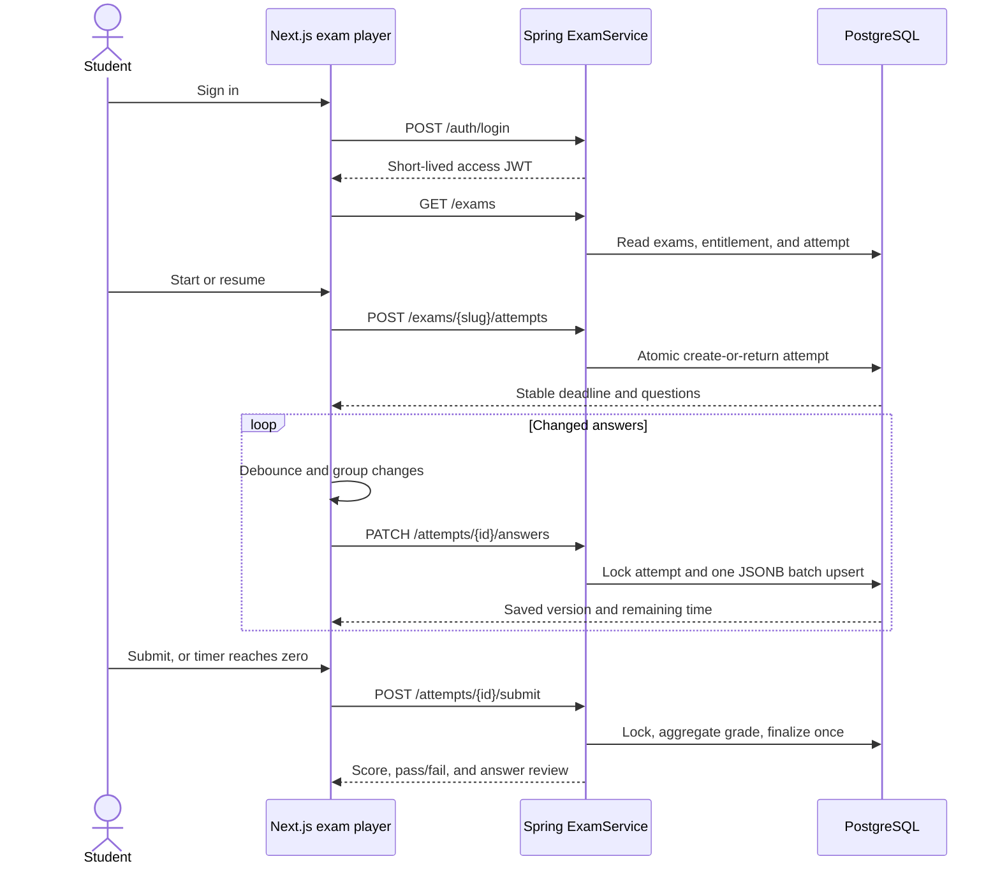

# Online exams and 100-user capacity

ENAcademy now includes a real, database-backed online-exam domain for approved students who own the matching A1 or A2 course. This document explains the workflow, the concurrency protections, the runtime tuning, and how to prove the 100-simultaneous-user target on the hardware that will host the application.

## Capacity statement

The engineering target is **100 simultaneous students completing the full login → exam → autosave → submit workflow with no failed requests or lost answers**. The application has been designed and configured for that workload, and the repository includes a repeatable 100-user test. Capacity is never an unconditional property of source code: CPU, RAM, database limits, network latency, reverse proxies, and other traffic affect the result. Run the supplied test against the actual staging/production-sized environment before launch.

Recommended starting deployment for this target:

- 2–4 current CPU cores and 4 GiB RAM for the Spring/Next workload;
- PostgreSQL on SSD-backed storage with at least 40 available connections;
- Redis on a private low-latency network;
- a reverse proxy with request timeouts longer than the measured p95 login time;
- one warm application instance before students begin signing in.

These are starting assumptions, not a substitute for the test report from the target host.

## Student workflow



The deadline is established on the server and stored in PostgreSQL. Refreshing the page, changing local clock time, or reopening the route does not create more time. An expired attempt is finalized as `AUTO_SUBMITTED` whenever it is next read, saved, or submitted.

## Why the workflow remains correct under concurrency

| Risk | Protection |
| --- | --- |
| Two start clicks create two attempts | `UNIQUE(exam_id,user_id)` plus `INSERT ... ON CONFLICT DO NOTHING` creates or returns one attempt atomically |
| Save races with submit | Both operations lock the student's attempt row with `SELECT ... FOR UPDATE` inside a transaction |
| A repeated submit changes the result | Submission is idempotent; a finalized attempt is returned instead of graded again |
| A browser invents more time | PostgreSQL stores `deadline_at`; Spring calculates remaining time and enforces expiration |
| A browser changes question IDs/options | Spring validates every question and option against server-side exam data before saving |
| Correct answers leak during the exam | Active-attempt responses omit correct options and explanations; they appear only after finalization |
| Answer changes overload the API | The browser debounces changes, sends one batch, and Spring performs one JSONB-to-recordset upsert |
| Duplicate answer rows | `(attempt_id,question_id)` is the primary key and saves use an upsert |
| Slow scans at peak | Published-window, ordered-question, user-attempt, exam-status, active-deadline, and answer-question indexes support the hot queries |

## Runtime tuning for 100 users

Spring's Hikari pool is bounded at 30 connections by default. This is deliberately smaller than the 200 HTTP worker threads: fast requests may wait briefly for a connection instead of opening 100 simultaneous database sessions and overwhelming PostgreSQL. Five idle connections remain warm, and connection acquisition fails after five seconds rather than hanging indefinitely.

Tomcat accepts 1,000 connections, queues 200 requests, and runs up to 200 request threads with 20 warm spare threads. HTTP compression is enabled for responses over 1 KiB. The application uses graceful shutdown so in-flight exam saves are given time to complete during a normal restart.

| Variable | Default | Meaning |
| --- | ---: | --- |
| `DB_POOL_MAX` | 30 | Maximum concurrent PostgreSQL connections used by Spring |
| `DB_POOL_MIN_IDLE` | 5 | Warm idle connections |
| `DB_POOL_CONNECTION_TIMEOUT_MS` | 5000 | Maximum wait for a pooled connection |
| `SERVER_MAX_THREADS` | 200 | Maximum Tomcat request workers |
| `SERVER_MIN_SPARE_THREADS` | 20 | Warm request workers |
| `SERVER_ACCEPT_COUNT` | 200 | Requests queued when all workers are busy |
| `SERVER_MAX_CONNECTIONS` | 1000 | Maximum accepted connections |

Do not increase the database pool blindly. For multiple Spring instances, the combined maximum pools plus administration/backup connections must remain below PostgreSQL's `max_connections` with safety headroom.

## Database model

- `exams` stores bilingual metadata, course level, duration, pass percentage, publication, and availability window.
- `exam_questions` stores ordered bilingual prompts/options, the server-only correct option, explanation, and points.
- `exam_attempts` stores the one allowed attempt per student/exam, durable deadline, status, score, result, save timestamp, and version.
- `exam_answers` stores the latest selected option for every attempt/question pair.

The Flyway migration is `backend/src/main/resources/db/migration/V3__online_exams.sql`. It also seeds one complete six-question A1 exam and one six-question A2 exam.

## Run the 100-user proof

Start a clean or disposable local/staging stack, then run:

```bash
./start-app.sh
./scripts/exam-load-test.sh
```

The shell script:

1. checks that ENAcademy is reachable;
2. uses `scripts/exam-load-fixture.sql` to recreate exactly 100 isolated accounts whose emails end in `@enacademy.loadtest`;
3. verifies all accounts and grants the seeded A1 course entitlement;
4. launches all 100 logical students together;
5. prints request counts plus p50, p95, and maximum latency for login, list, start, save, and submit;
6. exits non-zero if any workflow fails or does not finalize.

The fixture resets only its own `exam-load-*@enacademy.loadtest` users and their related attempts/orders/entitlements. Never run test fixtures against a production database.

You can test a different reachable environment without provisioning it automatically:

```bash
BASE_URL=https://staging.example.com node scripts/exam-load-test.mjs
```

That environment must already contain the 100 fixture accounts. Optional controls are `EXAM_LOAD_USERS`, `EXAM_SLUG`, `EXAM_LOAD_PASSWORD`, and `EXAM_REQUEST_TIMEOUT_MS`.

## Acceptance criteria

For the target deployment, save the load-test output with the release evidence. A practical gate for this workload is:

- 100 requested, 100 completed, 0 failed, 0% error rate;
- all attempts end in `SUBMITTED` or `AUTO_SUBMITTED`;
- no duplicate attempts and no missing saved answers;
- p95 login below 5 seconds (BCrypt is intentionally CPU-expensive);
- p95 exam list/start/save/submit below 1 second;
- no sustained database-pool timeout, readiness failure, container restart, or PostgreSQL error;
- CPU and memory return to a stable baseline after the run.

If the target misses a gate, first identify whether CPU-heavy BCrypt login, the database pool, PostgreSQL I/O, memory pressure, or the proxy/network is saturated. Change one setting or resource at a time and rerun the exact same test.

## What this optimization does not claim

- It is not a promise for 100 users on every laptop or cheapest cloud instance.
- It does not test geographically distributed networks or a real email provider.
- It complements the Playwright end-to-end workflow but does not replace accessibility review or deployment-specific monitoring.
- It does not provide high availability; a single application/database instance can still fail.
- It does not add proctoring, essay grading, question authoring, random question banks, or multiple attempts.

For a public high-stakes exam, add production observability, backups/PITR, multiple application instances behind a load balancer, managed PostgreSQL, deployment rehearsals, incident procedures, and a policy for reconnects and appeals.
