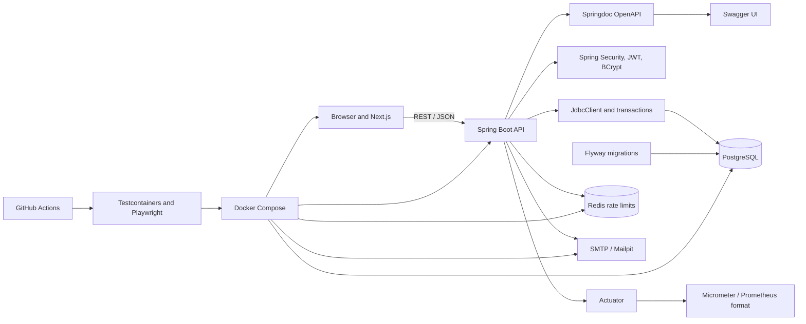
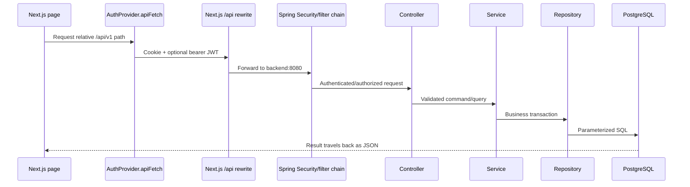
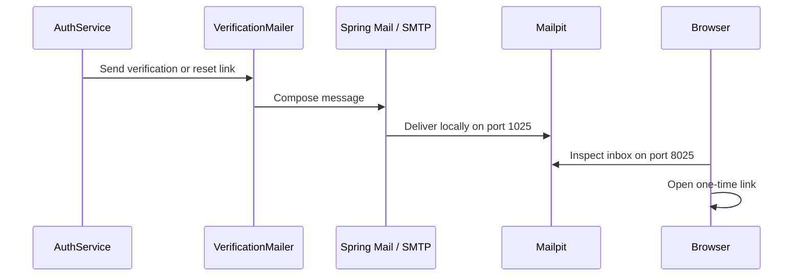
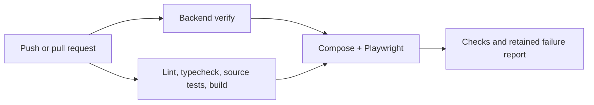
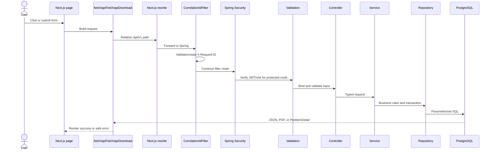
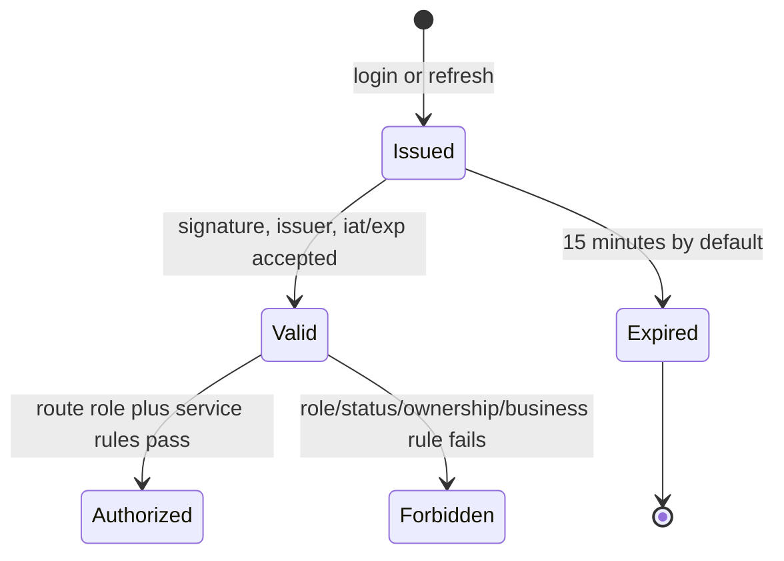
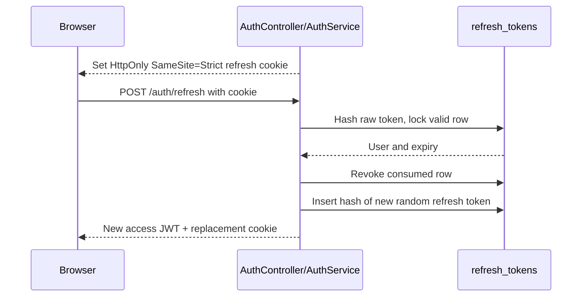
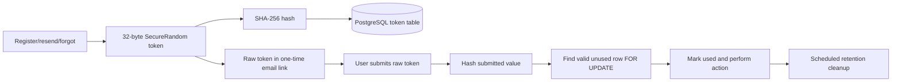
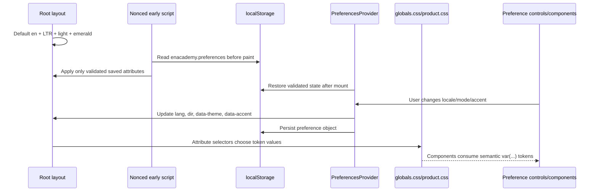
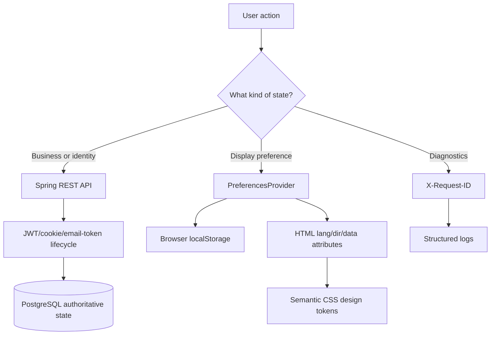

# ENAcademy platform tools — practical teaching guide

This guide teaches Swagger/OpenAPI and the other engineering tools that are actually connected to ENAcademy. It explains the job of each tool, why it exists, where it is configured, how it participates in a real request, how to inspect it safely, and what it does **not** do.

The guide assumes the local Docker application is started with:

```bash
./start-app.sh
```

Local development URLs:

| Purpose | URL |
|---|---|
| ENAcademy web application | `http://localhost:3000` |
| Swagger UI | `http://localhost:8080/docs` |
| Raw OpenAPI document | `http://localhost:8080/v3/api-docs` |
| Spring health | `http://localhost:8080/actuator/health` |
| Readiness probe | `http://localhost:8080/actuator/health/readiness` |
| Liveness probe | `http://localhost:8080/actuator/health/liveness` |
| Mailpit inbox | `http://localhost:8025` |

> These addresses and the example credentials are for local development only. Never paste a production password, access token, refresh cookie, reset link, or verification link into a public tool or screenshot.

## Learning map



The important idea is that these tools do different jobs. Swagger documents and explores the API; it does not run business rules. Flyway versions the schema; it does not back up the database. Redis limits abuse; it does not own user accounts. Playwright proves a browser journey; it does not replace load testing.

## 0. Foundation: language, framework, runtime, and build tool

Before studying individual integrations, separate four concepts that are often called “the technology” even though they have different roles.

### Backend foundation

| Part | Role |
|---|---|
| Java 21 | Programming language and type system used for backend source code |
| JVM / Temurin JRE | Runtime that executes the compiled backend application |
| Spring Boot | Application framework that configures web, security, validation, data, mail, scheduling, and operational components |
| Spring MVC | HTTP controller/request/response framework inside Spring Boot |
| Maven / Maven Wrapper | Resolves Java dependencies, compiles sources, runs tests, and packages the executable JAR |

`backend/mvnw` is the Maven Wrapper. It lets the project select a compatible Maven distribution instead of assuming every contributor installed the same version globally.

```bash
cd backend
./mvnw --batch-mode verify
```

`verify` is a build-lifecycle phase. It compiles, tests, packages, and runs configured verification steps. Spring Boot is not Maven: Spring runs the application; Maven builds and tests it.

### Frontend foundation

| Part | Role |
|---|---|
| TypeScript | JavaScript plus compile-time types used for frontend source |
| React | Component and state model for interactive UI |
| Next.js | Routing, server/client boundaries, builds, metadata, fonts, proxy/rewrite, and production server |
| Node.js | Runtime used to build and run the Next.js server |
| npm | Resolves frontend packages and runs project scripts from `package.json` |

`npm ci` installs exactly the dependency versions recorded in `package-lock.json`; it is preferred in CI and reproducible builds. `npm run` executes named project scripts rather than a feature built into npm itself.

```bash
cd frontend
npm ci
npm run typecheck
npm test
npm run build
```

### Git and GitHub foundation

Git stores local commits and branches. GitHub hosts the remote repository, pull requests, reviews, and Actions. A GitHub pull request is not an extra application runtime layer; it is a proposal to merge one Git branch into another with review and automated evidence.

**Success check:** you can distinguish Java from Spring, Spring from Maven, TypeScript from React, React from Next.js, Node.js from npm, and Git from GitHub.

---

## 1. OpenAPI, Swagger UI, and Springdoc

### 1.1 Three names that are often confused

| Name | Meaning in ENAcademy |
|---|---|
| **OpenAPI** | A machine-readable standard that describes HTTP paths, methods, parameters, request bodies, response schemas, and status codes. |
| **Swagger UI** | A browser interface that reads an OpenAPI document and displays interactive API documentation. |
| **Springdoc** | The Java library that examines the Spring MVC application and generates ENAcademy's OpenAPI document and Swagger UI. |

Swagger is therefore not the backend, database, or API. If Swagger UI is unavailable while Spring is running, the API may still work. If Swagger shows an endpoint, Spring Security and service rules still decide whether a request is allowed.

### 1.2 How ENAcademy enables it

The dependency is declared in [`backend/pom.xml`](../backend/pom.xml):

```xml
<dependency>
  <groupId>org.springdoc</groupId>
  <artifactId>springdoc-openapi-starter-webmvc-ui</artifactId>
</dependency>
```

The UI path is configured in [`backend/src/main/resources/application.yml`](../backend/src/main/resources/application.yml):

```yaml
springdoc:
  swagger-ui.path: /docs
```

[`SecurityConfig.java`](../backend/src/main/java/com/enacademy/config/SecurityConfig.java) allows local public access to `/docs/**` and `/v3/api-docs/**`.

Springdoc learns the contract from:

- controller annotations such as `@GetMapping`, `@PostMapping`, and `@PatchMapping`;
- Java record fields used as request and response models;
- path variables and request bodies;
- Jakarta Validation annotations such as `@NotBlank`, `@Email`, `@Size`, `@Min`, and `@Max`;
- the HTTP response types returned by controllers.

### 1.3 Read a Swagger operation

An operation combines four main facts:

1. **Method** — for example `GET`, `POST`, or `PATCH`.
2. **Path** — for example `/api/v1/learning/curriculum`.
3. **Input** — path variables, query values, headers, cookies, or a JSON body.
4. **Output** — HTTP status, headers, and a JSON or binary response.

Common method meanings in this project:

| Method | Typical meaning | ENAcademy example |
|---|---|---|
| `GET` | Read without changing business state | Get curriculum, dashboard, products, purchases, or exams |
| `POST` | Create a resource or perform a command | Register, login, checkout, start/submit an exam |
| `PATCH` | Change part of an existing resource | Save a word, change account status, update a product or exam |

HTTP method names are conventions, but the backend implementation is authoritative. A `GET` should not secretly create an order; a retryable `POST` must be designed carefully when it changes money, access, progress, or exam state.

### 1.4 First Swagger exercise: inspect a public endpoint

1. Start the platform with `./start-app.sh`.
2. Open `http://localhost:8080/docs`.
3. Find `GET /api/v1/learning/curriculum`.
4. Expand the operation and study its response schema.
5. Select **Try it out**, then **Execute**.
6. Compare the response body with the curriculum screen in the web application.

The equivalent command is:

```bash
curl -i http://localhost:8080/api/v1/learning/curriculum
```

**Success check:** you can identify the HTTP method, path, response status, content type, and top-level JSON shape without reading frontend code.

### 1.5 Inspect the raw OpenAPI document

Open `http://localhost:8080/v3/api-docs`. It is JSON intended for tools rather than people. Important top-level fields are:

- `openapi` — the specification version;
- `info` — API title/version metadata;
- `paths` — operations grouped by URL;
- `components.schemas` — reusable request/response shapes.

Save a local disposable copy if you want to study it:

```bash
curl http://localhost:8080/v3/api-docs --output /tmp/enacademy-openapi.json
```

Do not commit generated API output unless the project deliberately adopts a contract-versioning process. ENAcademy currently generates the document from running code.

### 1.6 Authentication and the current Swagger limitation

ENAcademy protects most endpoints with bearer access JWTs. The current code does not declare an OpenAPI bearer `securityScheme`, so Swagger UI documents the operations but does not provide the normal global **Authorize** button. This is a documentation-integration limitation, not an authentication bypass.

Public operations can be executed directly in Swagger UI. For a protected operation, use the web application or obtain a local token through login and call the API with `curl`:

```bash
curl -i \
  -H 'Content-Type: application/json' \
  -d '{"email":"<local-email>","password":"<local-password>"}' \
  http://localhost:8080/api/v1/auth/login
```

Copy only the local response's `accessToken` into a temporary shell variable:

```bash
ENACADEMY_ACCESS_TOKEN='<paste-local-access-token>'

curl -i \
  -H "Authorization: Bearer ${ENACADEMY_ACCESS_TOKEN}" \
  http://localhost:8080/api/v1/learning/dashboard

unset ENACADEMY_ACCESS_TOKEN
```

Never put the token in command history on a shared or production machine. A future OpenAPI improvement can add a bearer scheme and operation security declarations, but it must still preserve real Spring Security enforcement.

### 1.7 What Swagger/OpenAPI does not guarantee

- It does not prove that an endpoint is secure.
- It does not prove that examples are valid business scenarios.
- It does not test concurrency, transactions, email, browser state, or Docker startup.
- It does not replace backend tests, Playwright, the exam load test, or human review.
- It does not automatically describe every business rule, ownership condition, or error unless the project adds that documentation.

**Review questions**

1. What is the difference between OpenAPI, Swagger UI, and Springdoc?
2. Why can a documented operation still return `401` or `403`?
3. Where does the `/docs` path come from?
4. Why should generated OpenAPI not be treated as a database backup or test result?

---

## 2. REST, JSON, validation, and ProblemDetail

Swagger becomes much easier when you understand the protocol beneath it.

### 2.1 Request path through ENAcademy



[`frontend/next.config.ts`](../frontend/next.config.ts) rewrites browser `/api/:path*` calls to the Spring backend. Docker uses `http://backend:8080`; direct local frontend development falls back to `http://localhost:8080`.

### 2.2 Validation

Controller inputs use Jakarta Validation. For example, registration checks name length, email format, password length, and password complexity. Validation runs before the service changes the database.

An invalid request produces an RFC-style Spring `ProblemDetail` response similar to:

```json
{
  "title": "Validation failed",
  "status": 400,
  "detail": "Check the highlighted fields and try again.",
  "code": "VALIDATION_FAILED",
  "errors": {
    "email": "must be a well-formed email address"
  },
  "requestId": "a-safe-correlation-id"
}
```

The exact field message may vary with the validation provider. Frontend code should use stable codes and field maps, not parse an English sentence to decide business behavior.

### 2.3 Status codes used conceptually

| Status | Meaning |
|---:|---|
| `200` | Successful read or command with a response body |
| `201` | Resource/account created |
| `204` | Successful operation with no response body |
| `400` | Malformed or validation-invalid input |
| `401` | Missing, invalid, or expired authentication |
| `403` | Authenticated but not permitted by role/status/ownership/business access |
| `404` | Resource is absent or intentionally not disclosed |
| `409` | Current state conflicts with the requested transition |
| `429` | Rate limit exceeded |
| `500` | Unexpected server failure; use the request ID for diagnosis |

**Exercise:** trigger a harmless validation error on local registration, inspect the browser Network response, and connect its `errors` map to the highlighted form field.

---

## 3. Spring Actuator, Micrometer, and Prometheus format

### 3.1 Distinguish the tools

| Tool | Job in ENAcademy |
|---|---|
| Spring Actuator | Publishes operational endpoints such as health, readiness, liveness, info, and metrics integration. |
| Micrometer | Collects and names application/JVM/server metrics through a vendor-neutral API. |
| Prometheus registry | Renders Micrometer metrics in Prometheus text format at `/actuator/prometheus`. |

ENAcademy does **not** currently run a Prometheus server or Grafana dashboard. It exposes a scrape-compatible endpoint. A production monitoring system would still need to scrape, retain, query, visualize, and alert on those metrics.

### 3.2 Health endpoints

The public health family is permitted by Spring Security:

```bash
curl -i http://localhost:8080/actuator/health
curl -i http://localhost:8080/actuator/health/readiness
curl -i http://localhost:8080/actuator/health/liveness
```

- **Liveness** asks whether the process should be restarted.
- **Readiness** asks whether it should receive traffic.
- General **health** summarizes registered health contributors.

Docker Compose waits for backend readiness before starting the frontend. That is why a running container is not automatically considered a usable service.

### 3.3 Metrics access

`application.yml` exposes `health`, `info`, and `prometheus`, but `SecurityConfig` publicly permits only the health family. In the current local design, `/actuator/info` and `/actuator/prometheus` pass through the normal authenticated rule. Production should normally place detailed operational endpoints on a restricted management network or dedicated operator authentication, not ordinary student access.

**Review questions**

1. Why can liveness be healthy while readiness is unhealthy?
2. Does exposing Prometheus format mean Prometheus is installed?
3. Why should detailed metrics be more restricted than a simple health probe?

---

## 4. Flyway database migrations

Flyway is ENAcademy's database history manager. Migration files live in:

```text
backend/src/main/resources/db/migration/
```

Current ordered migrations:

1. `V1__platform_schema.sql`
2. `V2__beta_commerce.sql`
3. `V3__online_exams.sql`
4. `V4__account_recovery_and_token_maintenance.sql`

At startup Flyway:

1. connects to PostgreSQL;
2. reads `flyway_schema_history`;
3. verifies previously applied migration checksums;
4. applies pending versions in order;
5. records success or failure.

Hibernate is configured with `ddl-auto: validate`, so it checks rather than silently creating/changing tables.

### Safe migration rule

Never edit a migration that has already been shared or applied to a persistent environment. Create the next version instead. Rewriting history can produce checksum failures or, worse, different schemas that claim to have the same version.

Inspect local migration history:

```bash
docker compose exec postgres \
  psql -U enacademy -d enacademy \
  -c 'SELECT installed_rank, version, description, success FROM flyway_schema_history ORDER BY installed_rank;'
```

Adjust the local database user/name when `.env` overrides the defaults.

**Exercise:** choose one column in `exam_attempts`, find the migration that created it, then find the repository query and service rule that use it.

---

## 5. PostgreSQL, JdbcClient, and transactions

PostgreSQL is the durable source of truth. Accounts, approval, token hashes, curriculum, progress, exams, answers, products, orders, invoices, entitlements, words, and audit events live there.

ENAcademy repositories use Spring's `JdbcClient` with explicit parameterized SQL. Although Spring's data/JPA infrastructure is present, the domain does not rely on Hibernate entity classes or automatic ORM schema generation.

### Why explicit SQL fits this application

- Unlock queries, invoice joins, and exam grading are visible and reviewable.
- PostgreSQL features such as JSONB, `ON CONFLICT`, aggregates, and `FOR UPDATE` can be used intentionally.
- Parameter binding prevents values from being concatenated into SQL.
- Transaction boundaries remain in services where multi-step business invariants are understood.

### Database protection layers

```text
HTTP validation
  → authentication and authorization
    → service business rules and transaction
      → parameterized repository SQL
        → PostgreSQL foreign keys, unique constraints, checks, and locks
```

Each layer has a different purpose. A hidden frontend button is not authorization; a service check is not a replacement for a unique constraint under concurrency.

**Exercise:** inspect `ExamService.submit`, `ExamRepository.lockAttempt`, and the unique/index definitions in `V3__online_exams.sql`. Explain which race each layer prevents.

---

## 6. Redis and rate limiting

Redis stores fast, expiring counters for:

- failed login attempts;
- verification resend requests;
- password-reset requests.

The keys use non-reversible hashes of normalized request context rather than placing raw email/password data in the key. TTLs remove counters automatically. Successful login clears its relevant counter.

Redis is intentionally **not** the source of truth. If it restarts, ENAcademy may temporarily lose throttling history, but it does not lose users, purchases, progress, or exams. The current code fails open when Redis is unavailable to avoid turning a disposable protection dependency into a total authentication outage; a higher-risk deployment may choose gateway-level fail-closed limits.

Inspect local keys without exposing Redis as a host service:

```bash
docker compose exec redis redis-cli --scan
```

Do not run destructive Redis commands in an environment you do not own.

---

## 7. SMTP and Mailpit

SMTP is the delivery protocol used by `VerificationMailer`. Mailpit is a local SMTP receiver plus browser inbox.



Only the Mailpit web inbox is published to the host. The backend reaches SMTP through the internal Compose service name `mailpit`.

Mailpit is not a production mail provider. Production needs authenticated TLS SMTP or an email service, sender-domain configuration, delivery monitoring, bounce handling, and protected credentials.

**Exercise:** register a disposable local student, open Mailpit, inspect the verification link path, verify the account, and then confirm that the same token cannot be reused.

---

## 8. Spring Security, JWT, refresh cookies, and BCrypt

### 8.1 Authentication material

| Material | Purpose | Storage |
|---|---|---|
| Password | User knowledge factor | Never stored; BCrypt hash stored in `users` |
| Access JWT | Short proof of identity/role for API requests | Browser memory only; 15 minutes by default |
| Refresh token | Obtain a new access JWT | Raw value in HttpOnly SameSite cookie; SHA-256 hash in PostgreSQL |
| Verification token | Prove mailbox control | Raw value in email; hash in PostgreSQL |
| Password-reset token | Authorize one password reset | Raw value in email; hash in PostgreSQL |
| JWT signing secret | Sign/verify access JWTs | Backend environment configuration |

BCrypt uses cost 12. Hashing is deliberately CPU-expensive so stolen password hashes are harder to test at high speed. SHA-256 is used for high-entropy random token lookup, not for user passwords.

Spring Security:

- permits explicitly public routes;
- converts the JWT `role` claim into `ROLE_STUDENT` or `ROLE_ADMIN` authorities;
- protects `/api/v1/admin/**` with the ADMIN role;
- requires authentication for other non-public API routes;
- still relies on services for approval, suspension, ownership, entitlement, lesson order, and exam rules.

### 8.2 Why access and refresh tokens are separate

A short access JWT avoids a database lookup for cryptographic validity and limits its stolen lifetime. A rotating refresh token supports longer sessions, server-side revocation, logout, and password-reset session invalidation. The browser's `AuthProvider` keeps access state in memory and retries one request after a successful refresh.

**Review questions**

1. Why is BCrypt appropriate for passwords but not refresh-token lookup?
2. Why does a valid JWT not automatically grant lesson, invoice, or exam access?
3. Why does password reset revoke all refresh tokens?

---

## 9. Docker, Compose, health checks, and volumes

Docker builds isolated application images. Compose describes how the complete local platform is wired.

| Service | Role | Host port |
|---|---|---:|
| `frontend` | Next.js web app and API rewrite | 3000 |
| `backend` | Spring Boot API | 8080 |
| `mailpit` | Local inbox UI | 8025 |
| `postgres` | Durable relational database | Not published |
| `redis` | Internal rate-limit store | Not published |

Service names become internal DNS names. The backend connects to `postgres`, `redis`, and `mailpit`; the frontend server connects to `backend`. The browser never resolves those internal names.

Named volumes preserve PostgreSQL and Redis data when containers are recreated. `./stop-app.sh` preserves them; `docker compose down --volumes` deletes them and is not a normal stop command.

Both Dockerfiles use multi-stage builds and non-root runtime users. Build tools and dependency caches stay out of the smaller runtime stage.

Useful commands:

```bash
docker compose ps
docker compose logs -f backend frontend
docker compose config --quiet
./stop-app.sh
```

**Exercise:** use `docker compose ps` to identify the dependency order and explain why `running` and `healthy` are not the same state.

---

## 10. Testcontainers, source tests, Playwright, and GitHub Actions

### 10.1 Test layers

| Layer | What it catches |
|---|---|
| Backend/JUnit | Migration, repository, service, password-reset, invoice, and business-rule regressions |
| Testcontainers | Differences that require a real clean PostgreSQL instance and real Flyway migrations |
| Frontend source tests | Theme contrast, typography, registration, layout, commerce, exam, and recovery contract regressions |
| ESLint and TypeScript | Static code-quality and type errors |
| Production builds | Framework bundling, server/client boundaries, and packaging failures |
| Playwright | Real browser and multi-role lifecycle failures across all Compose services |
| Exam load harness | Concurrent login/start/save/submit errors and latency |

Testcontainers starts PostgreSQL 17 for backend integration tests when Docker is available. Playwright drives Chromium against the running Next.js application. These tools test different boundaries.

### 10.2 GitHub Actions order



The integrated job runs only after backend and frontend jobs pass. On failure it captures service logs; it always stops the disposable stack and uploads the Playwright report when present.

Run the main checks locally:

```bash
cd backend
./mvnw --batch-mode verify

cd ../frontend
npm ci
npm run lint
npm run typecheck
npm test
npm run build
```

Run Playwright only when the complete platform is healthy:

```bash
cd frontend
npm run test:e2e
```

**Success check:** you can choose the cheapest test layer that detects a change quickly while still running the broader layers before merging.

---

## 11. Next.js tools and browser APIs

### 11.1 Next.js rewrite

Browser code calls relative `/api/v1/...` paths. The rewrite keeps browser requests on the web origin and forwards them server-side to Spring. This simplifies cookies and avoids exposing a Docker hostname.

### 11.2 `next/font`

The UI uses Manrope for English and Vazirmatn for Persian through `next/font`. The invoice service separately bundles Noto Sans Arabic and Latin font files because PDF rendering happens inside Java, not in the browser.

### 11.3 Web Speech APIs

Lesson listening uses `speechSynthesis`; optional speaking recognition uses `SpeechRecognition` or `webkitSpeechRecognition` when the browser supports it. There is no ENAcademy speech API key. Browser support, privacy behavior, and remote processing can differ by vendor, so phrase overlap is motivational feedback rather than formal pronunciation grading.

### 11.4 CSP nonce and browser headers

[`frontend/proxy.ts`](../frontend/proxy.ts) creates a unique nonce and Content Security Policy per request. The layout uses that nonce for its early preference script. The response also restricts framing, object embedding, MIME sniffing, referrer leakage, sensitive browser capabilities, and cross-origin relationships.

Security headers reduce attack paths; they do not make unsafe application code safe automatically.

---

## 12. Structured logs and request correlation

Every Spring request receives an `X-Request-ID`. A safe caller-supplied value may be reused; otherwise the API creates a UUID. The same value is placed in:

- the response header;
- structured logging context;
- safe ProblemDetail error responses.

This lets an operator connect “the user saw request ID X” with one server-side request record. Logs record method, path without query parameters, status, and duration. They intentionally exclude passwords, bearer tokens, cookies, bodies, and email-link query strings.

Try a local correlation value:

```bash
curl -i \
  -H 'X-Request-ID: learning-guide-001' \
  http://localhost:8080/actuator/health
```

Then inspect backend logs:

```bash
docker compose logs backend
```

Production still needs a central log collector, retention rules, access control, search, dashboards, and alerts.

---

## 13. Persian invoice generation without an external API

The invoice PDF does not call a payment or PDF SaaS API. `InvoicePdfService`:

1. loads bundled Persian/Latin fonts;
2. draws an A4-shaped page using Java2D;
3. formats Persian text, Jalali date, item names, and toman prices;
4. encodes the rendered page as JPEG;
5. wraps it in a minimal single-page PDF structure;
6. returns bytes through an ownership-protected API endpoint.

The order and invoice facts come from PostgreSQL. PDF bytes are generated on demand and are not the source of truth. The checkout is explicitly simulated; producing an invoice does not mean a real bank payment happened.

---

## 14. Complete tool-to-file map

| Topic | Main implementation/configuration |
|---|---|
| Swagger/OpenAPI/Springdoc | `backend/pom.xml`, `application.yml`, Spring controllers, `SecurityConfig.java` |
| REST proxy | `frontend/next.config.ts`, `frontend/components/AuthProvider.tsx` |
| Validation/ProblemDetail | request records/services, `ApiExceptionHandler.java` |
| Actuator/Micrometer | `backend/pom.xml`, `application.yml`, Docker backend health check |
| Flyway | `application.yml`, `backend/src/main/resources/db/migration/` |
| PostgreSQL/JdbcClient | domain repositories, service transactions, Compose `postgres` |
| Redis | `RateLimitService.java`, Spring Redis configuration, Compose `redis` |
| SMTP/Mailpit | `VerificationMailer.java`, mail configuration, Compose `mailpit` |
| JWT/BCrypt/Spring Security | `AuthService.java`, `TokenRepository.java`, `SecurityConfig.java` |
| Docker/Compose | both Dockerfiles, `docker-compose.yml`, start/stop scripts |
| Testcontainers/JUnit | `backend/src/test/` and backend test dependencies |
| Playwright | `frontend/playwright.config.mjs`, `frontend/e2e/` |
| GitHub Actions | `.github/workflows/ci.yml` |
| CSP/security headers | `frontend/proxy.ts`, `frontend/app/layout.tsx`, `SecurityConfig.java` |
| Correlation/structured logs | `CorrelationIdFilter.java`, `ApiExceptionHandler.java`, `application.yml` |
| Web Speech | `frontend/components/LessonPlayer.tsx` |
| Fonts and invoice PDF | frontend layout, backend fonts, `InvoicePdfService.java` |

---

## 15. Troubleshooting guide

| Symptom | First checks | Likely concept |
|---|---|---|
| `/docs` does not open | `docker compose ps`, backend logs, port 8080 | Swagger UI depends on the Spring process |
| Swagger public call works but protected call returns `401` | Bearer token presence/expiry; current Swagger security-scheme limitation | Documentation is not authentication |
| Protected call returns `403` | User status, role, ownership, entitlement, sequence | Authentication succeeded; authorization/business access failed |
| Backend is running but frontend waits | Readiness endpoint and dependency health | Running is not ready |
| Migration checksum error | Check whether an applied migration was edited | Flyway history is immutable |
| Email message is missing | Mailpit health, backend mail host, backend logs | SMTP delivery path |
| Login limits disappear after Redis reset | Redis keys are disposable | Rate state is not durable identity data |
| Browser speech is unavailable | Browser support and permission | Web API capability differs by browser |
| Playwright fails after builds pass | Compose health, email flow, roles, cookies, real browser state | Integrated tests cross more boundaries |
| Prometheus URL returns `401` | Current Spring Security rules | Exposed does not mean publicly permitted |

---

## 16. Final practical project

Trace one real local workflow from documentation to evidence:

1. Open Swagger UI and find registration and verification operations.
2. Register a disposable local student through the real web page.
3. Inspect the verification message in Mailpit.
4. Follow the link and approve the student as the local administrator.
5. Use browser Network tools to inspect one authenticated dashboard request.
6. Find the controller, service, repository SQL, and database migration behind that request.
7. Find its security/ownership rule and expected ProblemDetail failure.
8. Find the backend, frontend, or Playwright test that protects the workflow.
9. Inspect the corresponding `X-Request-ID` in the response and backend log.
10. Explain which facts are durable in PostgreSQL, temporary in Redis/browser memory, and generated dynamically.

### Completion checklist

You understand this guide when you can explain:

- why Swagger UI is not the API;
- how Springdoc creates the OpenAPI document;
- why a visible endpoint can still be unauthorized;
- how Next.js routes browser API calls to Spring;
- why Flyway migrations should not be rewritten;
- why PostgreSQL and Redis have different responsibilities;
- how JWT, refresh cookies, password hashes, and email tokens differ;
- how Actuator health differs from Prometheus monitoring;
- how Testcontainers, Playwright, load testing, and CI cover different risks;
- how correlation IDs support debugging without logging secrets;
- which local tools must be replaced or extended before public production.

## Related ENAcademy documentation

- [Complete system and teaching guide](system-guide.md)
- [Architecture](architecture.md)
- [Database](database.md)
- [Security](security.md)
- [Online exams and 100-user capacity](exam-capacity.md)
- [Contribution guide](../CONTRIBUTING.md)

---

## 17. ENAcademy API handbook — what exists and how to use it

This chapter turns the earlier Swagger and REST concepts into a working map of ENAcademy's complete API surface.

### 17.1 What “API” means here

An API is a defined boundary through which one component requests behavior or data from another. ENAcademy uses several kinds:

| API/boundary | Caller → provider | Purpose |
|---|---|---|
| ENAcademy REST API | Next.js/browser → Spring Boot | Accounts, learning, exams, commerce, administration, files |
| OpenAPI endpoint | Developer tool/browser → Springdoc | Machine-readable REST contract |
| Swagger UI | Developer browser → generated OpenAPI | Human exploration and local public-operation execution |
| Actuator API | Docker/operator → Spring Boot | Health, readiness, liveness, info, metrics output |
| Web Speech API | Lesson component → browser | Speech synthesis and optional recognition |
| SMTP | Spring Mail → Mailpit/provider | Verification and password-reset message delivery |
| JDBC/PostgreSQL protocol | Spring repositories → PostgreSQL | Durable queries and transactions |
| Redis protocol | Rate-limit service → Redis | Expiring abuse counters |

Not every integration is an HTTP API, and not every API is external. ENAcademy currently uses no payment/banking, social-login, cloud speech-scoring, OpenAI, or external invoice-rendering API.

### 17.2 Base addresses and versioning

The browser calls relative paths:

```text
/api/v1/...
```

Next.js rewrites them to Spring. When calling Spring directly in local exercises, use:

```text
http://localhost:8080/api/v1/...
```

`v1` is the contract namespace. It gives the project a place to introduce a deliberately incompatible future contract without silently changing every existing client. It does not mean every internal implementation change requires `v2`.

### 17.3 Endpoint groups and access levels

| Group | Base path | Access model | Main caller |
|---|---|---|---|
| Authentication | `/api/v1/auth` | Mix of public recovery/session commands and authenticated `/me` | Login, verify, recovery pages, `AuthProvider` |
| Learning | `/api/v1/learning` | Curriculum public; dashboard/lessons/words/completion authenticated and approved | Dashboard and lesson player |
| Exams | `/api/v1/exams` | Authenticated, approved, entitled student; attempt ownership enforced | Exam center/player |
| Store | `/api/v1/store` | Authenticated; purchase/invoice/book ownership or entitlement enforced | Store and purchases |
| Student administration | `/api/v1/admin` | ADMIN role | Admin dashboard |
| Exam administration | `/api/v1/admin/exams` | ADMIN role | Exam operations |
| Commerce administration | `/api/v1/admin/commerce` | ADMIN role | Product/order/invoice operations |

### 17.4 Authentication API

| Method | Path | Purpose | Important lifecycle effect |
|---|---|---|---|
| `POST` | `/auth/register` | Create pending student | Hash password, create 24-hour verification token, send email |
| `POST` | `/auth/verify` | Prove mailbox control | Consume verification token, mark email verified |
| `POST` | `/auth/verification/resend` | Request a replacement link | Rate limit; consume/replace prior unused verification token |
| `POST` | `/auth/password/forgot` | Request reset email | Neutral response; rate limit; create reset token |
| `POST` | `/auth/password/reset` | Change password | Consume reset token and revoke every refresh session |
| `POST` | `/auth/login` | Authenticate | Return access JWT and set refresh cookie |
| `POST` | `/auth/refresh` | Rotate session | Consume old refresh token; issue new access and refresh tokens |
| `POST` | `/auth/logout` | End current refresh session | Revoke stored refresh hash and expire cookie |
| `GET` | `/auth/me` | Read current user | Requires bearer access JWT |

The actual prefix `/api/v1` is omitted from the shorter tables in this chapter.

### 17.5 Learning, exam, and commerce APIs

| Domain | Read operations | State-changing operations | Server rules that still apply |
|---|---|---|---|
| Learning | Curriculum, dashboard, lesson, saved words | Complete lesson, save/remove word | Approval, course entitlement, lesson sequence, bounded score, idempotent progress |
| Exams | List exams, read owned attempt | Start/resume, batch-save answers, submit | Publication/window, entitlement, one attempt, ownership, deadline, final status |
| Commerce | Products, purchases, invoice PDF, book PDF | Simulated checkout | Active product, no duplicate entitlement, price from DB, invoice ownership, book entitlement |
| Administration | Students, audits, exams, products, orders | Change status, schedule exam, change product | ADMIN role plus service validation and audit |

### 17.6 Four frontend request patterns

#### Pattern A — public JSON request

Registration and recovery use direct `fetch` because no access JWT exists yet:

```ts
await fetch('/api/v1/auth/password/forgot', {
  method: 'POST',
  headers: { 'content-type': 'application/json' },
  body: JSON.stringify({ email }),
});
```

#### Pattern B — authenticated JSON request

Pages use `apiFetch<T>` from `AuthProvider`. It attaches the in-memory access token, includes cookies, and performs one refresh-and-retry after a `401`:

```ts
const dashboard = await apiFetch<DashboardView>('/api/v1/learning/dashboard');
```

#### Pattern C — authenticated command with JSON

```ts
await apiFetch('/api/v1/exams/attempts/<attempt-id>/answers', {
  method: 'PATCH',
  headers: { 'content-type': 'application/json' },
  body: JSON.stringify({ answers }),
});
```

The server revalidates IDs and state. A TypeScript type improves the client but does not authorize the request.

#### Pattern D — authenticated binary download

Invoices and books use `apiDownload`, which returns a `Blob` instead of parsing JSON:

```ts
const pdf = await apiDownload('/api/v1/store/invoices/<invoice-id>/pdf');
```

The browser then creates a temporary object URL. Possessing the UUID is not permission; Spring checks ownership or ADMIN access.

### 17.7 Complete API request lifecycle



### 17.8 Use an API safely with `curl`

Read a public endpoint:

```bash
curl -i http://localhost:8080/api/v1/learning/curriculum
```

Send a public recovery request without revealing whether an account exists:

```bash
curl -i \
  -H 'Content-Type: application/json' \
  -d '{"email":"student@example.test"}' \
  http://localhost:8080/api/v1/auth/password/forgot
```

For protected endpoints, obtain a **local** access token from a login response, store it temporarily, use it, then remove it:

```bash
ENACADEMY_ACCESS_TOKEN='<local-token>'

curl -i \
  -H "Authorization: Bearer ${ENACADEMY_ACCESS_TOKEN}" \
  http://localhost:8080/api/v1/exams

unset ENACADEMY_ACCESS_TOKEN
```

Do not use `-v` casually with authentication because verbose output can expose headers and cookies in terminal history, logs, screenshots, or pasted bug reports.

### 17.9 How to add a new API operation correctly

1. Define the user outcome and authorization rule.
2. Choose the HTTP method/path and request/response shape.
3. Add Jakarta Validation to untrusted input.
4. Add the controller only as an HTTP adapter.
5. Put business rules and transaction boundaries in the service.
6. Put parameterized SQL and mapping in the repository.
7. Add database constraints/migration when a durable invariant changes.
8. Return stable ProblemDetail codes for expected failures.
9. Add the correct client pattern: direct fetch, `apiFetch`, or `apiDownload`.
10. Add backend, frontend, and E2E coverage proportional to risk.
11. Confirm the operation appears correctly in OpenAPI/Swagger.
12. Update the API and security documentation.

**Review questions**

1. Why are database credentials not REST API tokens?
2. Why does `apiFetch` retry only after refresh instead of retrying every failure?
3. Why is an invoice UUID not authorization?
4. When should a response be JSON and when should it be a `Blob`?
5. Which layers must change when a new durable business invariant is introduced?

---

## 18. Security tokens — complete lifecycle and management guide

“Token” means a value used as a compact reference, proof, or one-time capability. Tokens do not all have the same sensitivity, storage, or lifecycle.

### 18.1 Security-token inventory

| Token/value | Created by | Raw value location | Server storage | Default lifetime | End of lifecycle |
|---|---|---|---|---|---|
| Access JWT | `AuthService.createSession` | Login/refresh JSON; browser memory | Not stored as a row | 15 minutes | Expires; new one issued through refresh |
| Refresh token | `AuthService.createSession` | HttpOnly `enacademy_refresh` cookie | SHA-256 hash in `refresh_tokens` | 14 days | Rotated on refresh, revoked on logout/reset, or expires |
| Email verification token | Register/resend | One-time email link | SHA-256 hash in `email_verification_tokens` | 24 hours | Consumed once, replaced by resend, or expires |
| Password-reset token | Forgot-password request | One-time email link | SHA-256 hash in `password_reset_tokens` | 60 minutes by default | Consumed once, replaced by new request, or expires |
| Login rate key | `RateLimitService` | Never sent to user | Hashed Redis key/counter | 15-minute window | Cleared on successful login or TTL expiry |
| Resend/reset rate keys | `RateLimitService` | Never sent to user | Hashed Redis key/counter | 15-minute window | TTL expiry |
| Request ID | Client or `CorrelationIdFilter` | Header and safe error | Logging context, not auth DB | One request | Request completes; logs retain according to log policy |

### 18.2 Access JWT lifecycle



The JWT contains:

- `iss` — expected issuer;
- `sub` — user UUID;
- `role` — `STUDENT` or `ADMIN`;
- `email` and `name` — session display claims;
- `iat` and `exp` — issue and expiry times.

It is signed with HS256. Spring verifies signature, issuer, and time before creating the authenticated principal. Services then reload authoritative account state where needed, so a suspended user cannot rely only on an older claim.

The access JWT is kept in module memory, not `localStorage`. Reloading the page loses it and `AuthProvider` uses the refresh cookie to establish a new session.

### 18.3 Refresh-token rotation lifecycle



Cookie properties:

- name: `enacademy_refresh`;
- `HttpOnly`: JavaScript cannot read it;
- `SameSite=Strict`: reduces cross-site sending;
- path: `/api/v1/auth`;
- max age: refresh lifetime;
- `Secure`: false only for local HTTP, must be true with production HTTPS.

Rotation means a refresh token is consumed once. Password reset revokes all refresh rows for the user. Logout revokes the current row and expires the browser cookie.

### 18.4 Verification and reset-token lifecycle



The raw random token cannot be reconstructed from its database hash. `FOR UPDATE` plus `used_at` prevents two simultaneous successful consumptions. A replacement request marks the prior unused token used before inserting a new hash.

### 18.5 Cleanup lifecycle

`TokenCleanupService` runs daily at `03:20 UTC` by default:

- expired verification, refresh, and reset rows are removed;
- used verification/reset rows and revoked refresh rows are retained for seven days by default, then removed;
- only aggregate cleanup counts are logged;
- user, audit, learning, commerce, and exam records are not token-cleanup targets.

Expiry and cleanup solve different problems. Expiry makes a token unusable; cleanup removes no-longer-needed rows later.

### 18.6 Values that are not authentication tokens

| Value | Why it is not authentication |
|---|---|
| User, invoice, product, exam, question, or attempt UUID | Identifies a record; ownership/role must still be checked |
| Lesson slug | Selects content; entitlement and sequence remain server rules |
| `X-Request-ID` | Correlates diagnostics; proves no identity |
| Redis rate-limit key | Tracks abuse window; grants no access |
| CSP nonce | Authorizes one inline script under one response policy; it is not a user session |
| CSS design token | A style variable such as `--paper`; it has no security meaning |

### 18.7 Token safety rules

- Never log raw passwords, JWTs, refresh cookies, or email-link tokens.
- Never put access/refresh tokens into URLs; URLs leak through history and logs.
- Never store the access JWT in `localStorage` without a deliberate security redesign.
- Never store raw opaque session/email tokens in PostgreSQL; store one-way hashes.
- Use cryptographic randomness for opaque tokens, not predictable UUID sequences or timestamps.
- Validate signature, issuer, expiry, role, current account state, and resource authorization at their proper layers.
- Rotate refresh tokens and revoke sessions after password reset.
- Treat local Mailpit links as credentials while they are valid.
- Replace development signing secrets before public production.

**Review questions**

1. Why is the access JWT signed but not stored in the token tables?
2. Why are refresh and email tokens hashed before database storage?
3. What is the difference between expiration, consumption, revocation, rotation, and cleanup?
4. Why does knowing an attempt UUID not let another student submit it?
5. Why is a CSP nonce called a token but not an authentication token?

---

## 19. Theme and design tokens — usage and preference lifecycle

Theme tokens are CSS custom properties that carry visual meaning. They are unrelated to JWTs or login sessions.

### 19.1 Three user preferences

| Preference | Allowed values | HTML effect | Visual/behavioral result |
|---|---|---|---|
| Locale | `en`, `fa` | `lang` and `dir` | Translation lookup, English/Persian font, LTR/RTL layout |
| Color mode | `light`, `dark` | `data-theme` | Surface/text/contrast token values |
| Accent | `emerald`, `ocean`, `violet`, `sunset`, `rose` | `data-accent` | Brand/action/highlight palette values |

They are saved together in browser `localStorage` under:

```text
enacademy.preferences
```

Example value:

```json
{
  "locale": "fa",
  "mode": "dark",
  "accent": "ocean"
}
```

This data contains display preferences, not identity or authorization. It is not synchronized to PostgreSQL and does not follow the user to another browser/device.

### 19.2 Preference lifecycle



The early script reduces a bright-theme or wrong-direction flash before React hydrates. Its CSP nonce is generated for that response. `PreferencesProvider` then owns interactive state after the page mounts.

Malformed or unknown saved values are ignored. This prevents an arbitrary stored string from becoming an uncontrolled attribute/class.

### 19.3 Semantic design-token map

| Token | Semantic job | Typical consumers |
|---|---|---|
| `--ink` | Primary text | Body, headings, controls |
| `--muted` | Secondary text | Descriptions, metadata, hints |
| `--paper` | Page background | Public, auth, dashboard, lesson shells |
| `--panel` | Main raised surface | Cards, dialogs, sidebars, exam panels |
| `--panel-soft` | Secondary/selected surface | Tabs, answer rows, progress backgrounds |
| `--line` | Subtle borders/dividers | Cards, tables, inputs |
| `--mint` | Primary accent | Highlights, status, decorative elements |
| `--mint-dark` | Strong accent | Links, emphasized controls, focus/status text |
| `--lime` | Bright highlight/action | Primary calls to action, rewards |
| `--violet`, `--amber` | Supporting accents | Signals, warnings, illustrations |
| `--deep` | Deep branded surface | Dark brand panels and gradients |
| `--solid-bg`, `--solid-fg` | Solid button/logo background and foreground pair | Wordmark, solid actions |
| `--accent-solid`, `--on-accent` | Accent surface and readable foreground pair | Accent icons/controls |
| `--on-highlight` | Text on bright highlight | Main highlighted buttons |

Components should consume semantic meaning, for example:

```css
.example-card {
  color: var(--ink);
  background: var(--panel);
  border: 1px solid var(--line);
}
```

They should not copy one palette's hex values into every component. Central tokens let one mode/accent update the entire system and make contrast fixes consistent.

### 19.4 How mode and accent combine

The root light theme defines default semantic tokens. An accent selector changes brand values:

```css
html[data-accent="ocean"] {
  --mint: #38bdf8;
  --mint-dark: #0369a1;
}
```

Dark mode changes surfaces/text and contrast relationships:

```css
html[data-theme="dark"] {
  --ink: #edf7f2;
  --paper: #08110e;
  --panel: #101b17;
}
```

Combined selectors adjust an accent specifically for dark surfaces:

```css
html[data-theme="dark"][data-accent="ocean"] {
  --mint-dark: #7dd3fc;
}
```

The browser performs the cascade. React does not calculate every component color.

### 19.5 How to add a new themed component

1. Decide the semantic roles: page, panel, text, muted text, border, accent, highlight.
2. Use existing `var(--token)` values first.
3. If a new semantic role is genuinely needed, define it in `:root`.
4. Define its dark-mode value and any accent combinations that require different contrast.
5. Test English and Persian, LTR and RTL, all five accents, light and dark modes.
6. Test hover, focus, disabled, correct/wrong, warning, and error states.
7. Avoid relying on color alone to communicate meaning.
8. Add or update the theme contrast regression test.

### 19.6 How to add a sixth accent safely

A new accent is a cross-file contract:

1. Add the literal to the `Accent` TypeScript union.
2. Add it to the validated `accents` list in `PreferencesProvider`.
3. Allow it in the early layout script's validated list.
4. Add light CSS token overrides.
5. Add dark+accent CSS overrides.
6. Add palette-dot styling and translated label keys.
7. Exercise persistence/restoration and invalid-value fallback.
8. Run contrast, typography, layout, typecheck, build, and Playwright gates.

Missing one validation list could make a value selectable during one visit but fail to restore on reload.

### 19.7 Preference reset and lifecycle boundaries

To reset only display preferences in a local browser console:

```js
localStorage.removeItem('enacademy.preferences');
location.reload();
```

This does not log the user out or change server data. Conversely, logout does not remove the chosen theme because session and preference lifecycles are intentionally separate.

Theme preferences currently have no account API, expiry, server cleanup, multi-device sync, or audit event. `localStorage` keeps them until the user/browser clears site data or code replaces the value.

### 19.8 Theme and localization lessons you should remember

- `lang` helps browsers and assistive technology understand the document language.
- `dir` controls layout direction; translating text without switching direction is incomplete Persian support.
- Fonts are part of readability, not only decoration.
- Dark mode requires explicit contrast review; inverting colors mechanically is not enough.
- Accent palettes must preserve readable foreground/background pairs.
- CSP nonce lifecycle protects the early script; localStorage preference lifecycle restores appearance; neither authenticates a user.
- Fixed controls must be tested against lesson navigation and mobile layouts so they do not overlap actions.
- Server-rendered defaults plus validated early restoration reduce hydration mismatch and visual flash.

### 19.9 Practical theme exercise

1. Open DevTools and inspect `<html>`.
2. Change mode and accent through the UI; watch `data-theme` and `data-accent` change.
3. Switch Persian/English; watch `lang` and `dir` change.
4. Inspect `localStorage['enacademy.preferences']`.
5. Reload and confirm the early script restores the selection.
6. Temporarily inspect a card's computed `--panel`, `--ink`, and `--line` values.
7. Clear only the preference key and confirm default `en/light/emerald` returns.
8. Confirm the authenticated session remains independent from the appearance reset.

**Review questions**

1. What is the difference between a CSS design token, CSP nonce, and access JWT?
2. Why does the project validate stored preference values before applying them?
3. Why are semantic names like `--panel` better than repeating one hex value?
4. Which files must change to add an accent?
5. Why does logout preserve the theme?
6. What must be tested beyond simply seeing that dark mode looks darker?

---

## 20. Combined API, security-token, and theme-token mental model



Use this decision rule:

- If the value grants access or changes durable business state, the server must validate it.
- If the value only changes appearance on one browser, validated local preference state is appropriate.
- If the value connects one error to one log entry, it is correlation metadata—not identity.
- If the value names a database record, it still requires authentication, role, ownership, and business-rule checks.

**Final success check:** you can trace an API request, an access/refresh/email token, a CSP nonce, a request ID, and a CSS design token through their separate creators, transports, storage locations, validation rules, expiry/cleanup behavior, and consumers without treating one as another.
