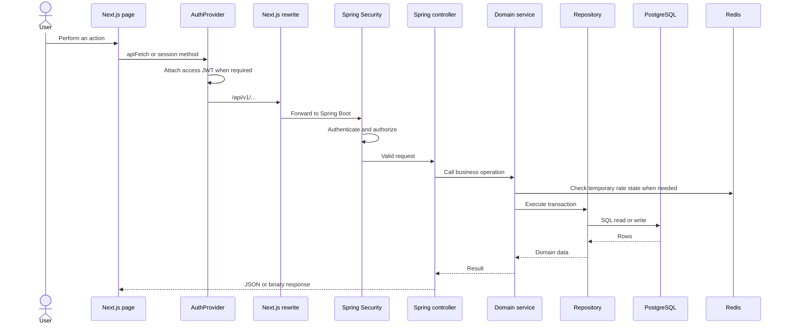
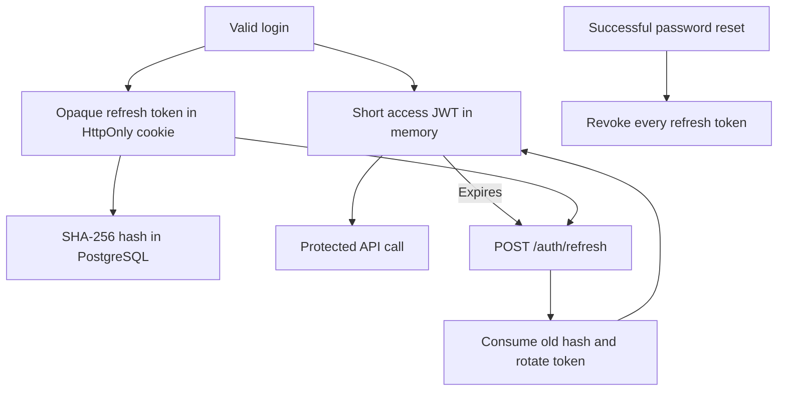
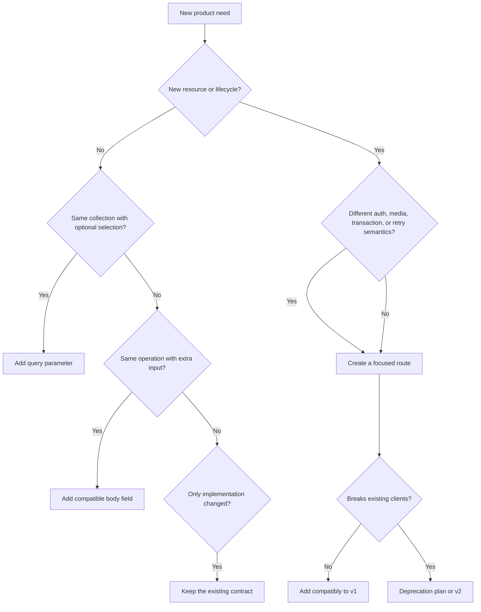
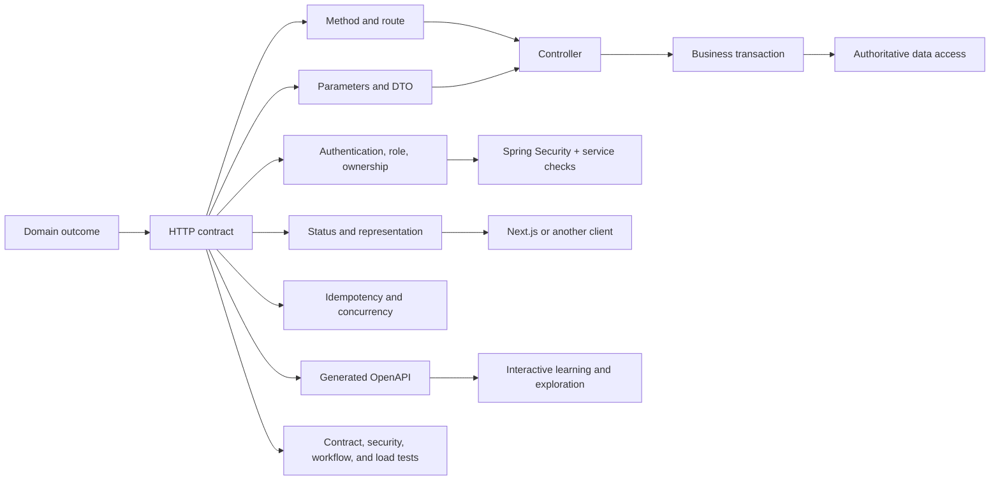

# ENAcademy Swagger and API teaching guide

This standalone guide teaches the API concepts used by ENAcademy and shows how Swagger UI, OpenAPI, Springdoc, Spring Security, validation, tokens, controllers, services, PostgreSQL, Redis, and the Next.js frontend connect. It is written for learning and for practical local debugging.

## 1. What you will learn

After completing this guide, you should be able to:

- explain the difference between an API, REST, HTTP, OpenAPI, Swagger UI, and Springdoc;
- open and read ENAcademy's generated API contract;
- identify public, authenticated-student, owner-only, and administrator operations;
- understand JSON request bodies, response bodies, status codes, and ProblemDetail errors;
- trace a request from a Next.js page to Spring Boot and PostgreSQL;
- explain access JWTs, refresh tokens, email-verification tokens, and password-reset tokens;
- test a safe public operation in Swagger UI;
- test protected operations without weakening Spring Security;
- diagnose common failures such as `400`, `401`, `403`, `404`, and a blank Swagger page;
- add a new API operation using the project's controller-service-repository workflow.

## 2. Quick access

Start the complete local platform:

```bash
./start-app.sh
```

Then use these addresses:

| Tool | Address | Purpose |
| --- | --- | --- |
| Web application | `http://localhost:3000` | Student and administrator interface |
| Swagger UI | `http://localhost:8080/docs` | Human-friendly interactive API documentation |
| Swagger implementation page | `http://localhost:8080/swagger-ui/index.html` | Page to which `/docs` redirects |
| Raw OpenAPI document | `http://localhost:8080/v3/api-docs` | Machine-readable generated contract |
| API readiness | `http://localhost:8080/actuator/health` | Spring health information |
| Mailpit | `http://localhost:8025` | Local verification and reset messages |

`/docs` is the recommended Swagger URL. Springdoc redirects it to `/swagger-ui/index.html`.

## 3. The important terms

| Term | Meaning |
| --- | --- |
| API | A defined way for software components to communicate |
| HTTP | The request/response protocol used between the browser and Spring Boot |
| REST | A resource-oriented style for designing HTTP APIs |
| JSON | The text format used for most ENAcademy request and response bodies |
| Endpoint | One HTTP method and path, such as `POST /api/v1/auth/login` |
| OpenAPI | A standard machine-readable description of HTTP operations and schemas |
| Swagger UI | A browser interface that reads an OpenAPI document |
| Springdoc | The Java library that generates ENAcademy's OpenAPI document from Spring code |
| Controller | The Spring entry point that receives and validates HTTP input |
| Service | The layer containing transactions and business rules |
| Repository | The layer that reads and writes authoritative PostgreSQL data |
| Authentication | Proving which user is making a request |
| Authorization | Deciding what that authenticated user may do |

Swagger is not the API itself. Spring Boot continues to serve the API if Swagger UI is unavailable. Swagger displays the contract, while Spring Security and service rules enforce the real behavior.

## 4. How Swagger is connected

The dependency is declared in `backend/pom.xml`:

```xml
<dependency>
  <groupId>org.springdoc</groupId>
  <artifactId>springdoc-openapi-starter-webmvc-ui</artifactId>
</dependency>
```

The friendly path is configured in `backend/src/main/resources/application.yml`:

```yaml
springdoc:
  swagger-ui:
    path: /docs
    display-request-duration: true
    operations-sorter: method
    tags-sorter: alpha
    filter: true
    persist-authorization: false
    doc-expansion: none
```

`OpenApiConfig.java` adds the human-facing title, version, descriptions, ordered domain tags, the bearer JWT scheme, and the browser-managed refresh-cookie scheme. Controller `@Operation` annotations supply summaries and business explanations. `@SecurityRequirement` marks only the operations that actually need credentials, so a lock icon has meaning instead of appearing everywhere.

Springdoc examines:

- `@RestController` and controller base paths;
- `@GetMapping`, `@PostMapping`, and `@PatchMapping` methods;
- request and response Java records;
- path variables, query parameters, cookies, and request bodies;
- Jakarta Validation rules such as `@NotBlank`, `@Email`, `@Size`, `@Min`, and `@Max`.

Spring Security permits the documentation resources:

```text
/docs
/docs/**
/swagger-ui.html
/swagger-ui/**
/v3/api-docs/**
```

The Swagger UI needs both its HTML page and its JavaScript/CSS resources. Permitting only `/docs` is insufficient because `/docs` redirects to `/swagger-ui/index.html`.

```mermaid
flowchart LR
    Browser[Browser opens /docs] --> Redirect[302 redirect]
    Redirect --> UI[/swagger-ui/index.html]
    UI --> Assets[Swagger JavaScript and CSS]
    Assets --> Contract[/v3/api-docs]
    Contract --> Controllers[Spring controller metadata]
    Controllers --> Screen[Interactive endpoint documentation]
```

## 5. Anatomy of an HTTP request

An HTTP request can contain:

1. a method;
2. a path;
3. headers;
4. optional path or query values;
5. an optional body.

Example login request:

```http
POST /api/v1/auth/login HTTP/1.1
Host: localhost:8080
Content-Type: application/json

{
  "email": "student@example.test",
  "password": "ExamplePass2026"
}
```

The response contains a status, headers, and usually a body:

```http
HTTP/1.1 200 OK
Content-Type: application/json
Set-Cookie: enacademy_refresh=...; HttpOnly; SameSite=Strict

{
  "accessToken": "...",
  "expiresIn": 900,
  "user": {
    "role": "STUDENT",
    "status": "APPROVED"
  }
}
```

Never place real production passwords or tokens in documentation, screenshots, Git commits, or shared command history.

## 6. HTTP methods used by ENAcademy

| Method | Intended use | Examples |
| --- | --- | --- |
| `GET` | Read data without changing business state | Curriculum, dashboard, products, invoices list, exams |
| `POST` | Create something or execute a command | Register, login, purchase, start exam, submit exam |
| `PATCH` | Partially update existing state | Save words, save exam answers, update student status |
| `DELETE` | Remove a resource | Not currently part of the public application API |

A method communicates intent but does not enforce correctness by itself. The service transaction is authoritative.

## 7. Status codes and their meaning

| Status | Meaning in this project | Example |
| --- | --- | --- |
| `200 OK` | Successful read or command | Login, dashboard, reset password |
| `201 Created` | A new resource was created | Student registration |
| `204 No Content` | Success with no body | Some logout-style operations may use this pattern |
| `302 Found` | Browser redirect | `/docs` redirects to Swagger UI |
| `400 Bad Request` | Invalid input, expired token, or invalid state | Reused password-reset token |
| `401 Unauthorized` | Missing, expired, or invalid authentication | Protected operation without a valid JWT |
| `403 Forbidden` | Identity is known but access is not allowed | Student calls an ADMIN operation |
| `404 Not Found` | Route or requested resource does not exist | Unknown lesson or incorrect URL |
| `409 Conflict` | Request conflicts with current state | Registering an existing email |
| `429 Too Many Requests` | Rate limit rejected the request | Repeated login or recovery attempts |
| `500 Internal Server Error` | Unexpected server failure | Safe ProblemDetail plus a request ID |

`401` and `403` are different. `401` asks for valid authentication; `403` means the authenticated identity lacks permission or the account state forbids the action.

## 8. ENAcademy ProblemDetail errors

Spring converts expected failures into structured ProblemDetail JSON:

```json
{
  "type": "https://enacademy.dev/problems/validation_failed",
  "title": "Validation failed",
  "status": 400,
  "detail": "Check the highlighted fields and try again.",
  "code": "VALIDATION_FAILED",
  "requestId": "correlation-id",
  "errors": {
    "email": "must be a well-formed email address"
  }
}
```

Important fields:

- `status` is the HTTP category;
- `code` is the stable application identifier;
- `detail` is a safe human-readable explanation;
- `errors` maps validation failures to input names;
- `requestId` connects the browser failure to structured backend logs.

Frontend code should prefer stable `code` and field names rather than parsing English sentences.

## 9. Request path through the platform



The browser normally calls relative `/api/v1/...` addresses on port `3000`. `frontend/next.config.ts` rewrites them to the Spring backend. Swagger talks directly to Spring on port `8080`.

## 10. Authentication and token lifecycle

### Access JWT

- Returned after successful login or refresh.
- Stored only in frontend memory.
- Sent as `Authorization: Bearer <token>`.
- Short lifetime: 15 minutes by default.
- Contains identity claims such as user ID and role.
- Signed with `JWT_SECRET`; it is not encrypted storage.

### Refresh token

- A random opaque value stored in an HttpOnly cookie.
- JavaScript cannot read the cookie.
- Only a SHA-256 hash is stored in PostgreSQL.
- Rotated when `/auth/refresh` succeeds.
- Revoked at logout, suspension-sensitive flows, and successful password reset.

### Email-verification token

- Generated from 32 secure random bytes.
- Raw value appears only in the email link.
- SHA-256 hash is stored in PostgreSQL.
- Expires after 24 hours and is single-use.

### Password-reset token

- Generated from 32 secure random bytes.
- Raw value appears only in the recovery email.
- SHA-256 hash is stored in PostgreSQL.
- Expires after 60 minutes by default.
- Is consumed once; reuse returns `400`.
- Successful reset stores a new BCrypt cost-12 password hash and revokes refresh sessions.



Theme design tokens are unrelated to authentication tokens. CSS variables control appearance; JWTs and opaque tokens control identity and recovery.

## 11. API authorization groups

### Public operations

- account registration;
- email verification and resend;
- password-reset request and completion;
- login, refresh, and logout;
- public curriculum summary;
- Swagger/OpenAPI documentation;
- health readiness endpoints.

### Approved student operations

- dashboard and progress;
- lesson content and completion;
- saved words;
- store, purchases, owned invoices, and owned books;
- entitled exams, answer saving, and submission.

### Ownership rules

A student JWT does not grant access to every student's records. Services compare the authenticated user ID with purchase, invoice, attempt, or progress ownership.

### Administrator operations

Paths under `/api/v1/admin/**` require the `ADMIN` role. The UI hiding an admin link is not a security control; Spring Security is the control.

## 12. Current endpoint catalog

All application endpoints use the `/api/v1` base path.

### Authentication

| Method | Path | Purpose |
| --- | --- | --- |
| `POST` | `/auth/register` | Create a pending student |
| `POST` | `/auth/verify` | Consume an email-verification token |
| `POST` | `/auth/verification/resend` | Send a fresh verification link when appropriate |
| `POST` | `/auth/password/forgot` | Request a neutral-response reset email |
| `POST` | `/auth/password/reset` | Consume reset token and replace password |
| `POST` | `/auth/login` | Authenticate and create a session |
| `POST` | `/auth/refresh` | Rotate refresh token and return a new JWT |
| `POST` | `/auth/logout` | Revoke refresh token and expire cookie |
| `GET` | `/auth/me` | Return the authenticated user |

### Learning

| Method | Path | Purpose |
| --- | --- | --- |
| `GET` | `/learning/curriculum` | Public curriculum summary |
| `GET` | `/learning/dashboard` | Progress, saved words, XP, and entitlements |
| `GET` | `/learning/lessons/{slug}` | Lesson content and unlock state |
| `POST` | `/learning/lessons/{slug}/complete` | Persist completion score and XP |
| `GET` | `/learning/words` | List saved words |
| `PATCH` | `/learning/words` | Save or remove one word |

### Store

| Method | Path | Purpose |
| --- | --- | --- |
| `GET` | `/store/products` | Catalog plus ownership state |
| `POST` | `/store/purchases` | Approve beta purchase and grant entitlement |
| `GET` | `/store/purchases` | Student order and invoice history |
| `GET` | `/store/invoices/{invoiceId}/pdf` | Download an owned Persian invoice |
| `GET` | `/store/books/{productId}/download` | Download an owned book |

### Exams

| Method | Path | Purpose |
| --- | --- | --- |
| `GET` | `/exams` | List entitled exams and attempt state |
| `POST` | `/exams/{slug}/attempts` | Start or resume the student's attempt |
| `GET` | `/exams/attempts/{attemptId}` | Resume attempt and obtain server time |
| `PATCH` | `/exams/attempts/{attemptId}/answers` | Batch-save changed answers |
| `POST` | `/exams/attempts/{attemptId}/submit` | Submit, grade, and return review |

### Administration

| Method | Path | Purpose |
| --- | --- | --- |
| `GET` | `/admin/students` | Student metrics and approval queue |
| `PATCH` | `/admin/students/{id}/status` | Approve, reject, suspend, or restore student |
| `GET` | `/admin/audit` | Recent audit records |
| `GET` | `/admin/commerce` | Commerce operations overview |
| `PATCH` | `/admin/commerce/products/{productId}` | Change price or availability |
| `GET` | `/admin/commerce/invoices/{invoiceId}/pdf` | Download any invoice as admin |
| `GET` | `/admin/exams` | Exam schedule and attempt metrics |
| `PATCH` | `/admin/exams/{examId}` | Change exam publication and schedule |

Swagger's generated contract is the best source for exact schemas. This catalog explains business purpose.

## 13. Using Swagger UI safely

### Inspect a public operation

1. Open `http://localhost:8080/docs`.
2. Find `GET /api/v1/learning/curriculum`.
3. Expand it.
4. Read the response schema.
5. Select **Try it out**.
6. Select **Execute**.
7. Confirm a `200` response and compare it with the curriculum page.

### Inspect validation without creating an account

Expand `POST /api/v1/auth/register` and study its schema:

- name length: 2–120;
- valid email, maximum 320 characters;
- password length: 10–72;
- uppercase, lowercase, and number required.

Do not execute account creation unless you intentionally want a new local database record and verification email.

### Authorize a protected operation

The generated OpenAPI contract declares two security schemes:

- `bearerAuth` documents the short-lived access JWT used by protected API routes;
- `refreshCookie` documents the rotating HttpOnly cookie used by refresh and logout.

To explore a protected operation locally:

1. Execute `POST /api/v1/auth/login` with a disposable approved local account.
2. Copy only the `accessToken` value from the JSON response.
3. Select **Authorize** at the top of Swagger UI.
4. Paste the token value without adding the word `Bearer`.
5. Execute a protected operation such as `GET /api/v1/learning/dashboard`.
6. Select **Authorize** again and log out of the authorization dialog when finished.
7. Reloading the page clears the Swagger authorization value because `persist-authorization` is deliberately disabled.

The refresh cookie is HttpOnly and browser-managed. Swagger JavaScript cannot read it, which is the intended security property. When login and refresh are executed from the same local Swagger origin, the browser can still attach the cookie according to its path and SameSite rules.

The **Authorize** button improves exploration; it does not enforce security. Spring Security remains the real authorization boundary.

## 14. Calling the API from a terminal

Public curriculum request:

```bash
curl -i http://localhost:8080/api/v1/learning/curriculum
```

Login request:

```bash
curl -i \
  -H 'Content-Type: application/json' \
  -d '{"email":"<local-email>","password":"<local-password>"}' \
  http://localhost:8080/api/v1/auth/login
```

For a temporary local access token:

```bash
ENACADEMY_ACCESS_TOKEN='<paste-local-token>'

curl -i \
  -H "Authorization: Bearer ${ENACADEMY_ACCESS_TOKEN}" \
  http://localhost:8080/api/v1/learning/dashboard

unset ENACADEMY_ACCESS_TOKEN
```

Use only disposable local credentials in learning exercises. Shell history, terminal recordings, screenshots, and CI logs can expose pasted secrets.

## 15. JSON, DTOs, and validation

Spring request records define the accepted JSON shape. For example, registration requires `fullName`, `email`, and `password`. Unknown frontend fields do not create database columns.

Validation happens before the controller service call. This protects the service from malformed input, but service rules are still required for business state such as:

- email already registered;
- account not verified or approved;
- lesson still locked;
- product inactive;
- invoice owned by another user;
- exam outside its schedule;
- attempt already submitted.

Validation answers “is this input structurally acceptable?” Business logic answers “is this operation allowed now?”

## 16. Binary API responses

Most operations return JSON. Invoice and book endpoints return PDF bytes.

The frontend therefore has two shared paths:

- `apiFetch` for JSON;
- `apiDownload` for `Blob` responses such as books and invoices.

Trying to parse a PDF response as JSON would fail even when the server returned `200`.

## 17. API versioning

The `/api/v1` prefix provides a contract boundary. It does not mean every internal code edit requires `/v2`.

Usually compatible within `v1`:

- adding an optional response field;
- adding a new endpoint;
- improving implementation without changing the contract.

Potentially breaking:

- removing or renaming a required field;
- changing field meaning or type;
- changing authentication expectations;
- changing a status code clients rely on.

A future `/api/v2` should be introduced deliberately when incompatible behavior must coexist with `v1`.

## 18. How to add a new API operation

Use this workflow:

1. Define the user outcome and authorization rule.
2. Choose the method and resource path.
3. Define validated request and response records.
4. Add the controller entry point.
5. Put business rules and transaction boundaries in the service.
6. Put SQL and row mapping in the repository.
7. Add or update a Flyway migration if persistence changes.
8. Add Spring Security rules if the path has a new access category.
9. Connect the frontend through `AuthProvider`, `apiFetch`, or `apiDownload`.
10. Add backend tests and a browser test when it affects a user journey.
11. Open Swagger and verify the generated schema.
12. Update this guide and the system guide.

```mermaid
flowchart LR
    Requirement --> Contract[Method, path, request, response]
    Contract --> Security[Authentication and authorization]
    Security --> Controller
    Controller --> Service
    Service --> Repository
    Repository --> Migration[Flyway when needed]
    Migration --> Tests
    Tests --> Swagger[Inspect generated OpenAPI]
    Swagger --> Docs[Update teaching documentation]
```



Do not place database access directly in a controller or trust a role sent by the browser.

## 19. Testing the API

ENAcademy uses several complementary test layers:

| Test | Proves |
| --- | --- |
| Java unit/integration tests | Service rules, hashing, PDF output, migrations, and PostgreSQL behavior |
| Frontend Node tests | Source-level UI, validation, theme, and integration regressions |
| TypeScript and ESLint | Type and code-quality constraints |
| Playwright | Real browser journeys through Next.js, Spring, PostgreSQL, Redis, and Mailpit |
| Exam load test | Concurrent start, autosave, resume, and submission capacity |
| Swagger/OpenAPI check | Documentation UI and generated contract are reachable |

Swagger is an exploration tool, not a complete automated test suite.

## 20. Troubleshooting Swagger

### `/docs` returns a redirect

This is expected. It redirects to `/swagger-ui/index.html`.

### Swagger page returns `401`

Check that Spring Security permits all of:

```text
/docs
/docs/**
/swagger-ui.html
/swagger-ui/**
/v3/api-docs/**
```

The UI route and raw OpenAPI route are separate resources.

### The page is blank but `/v3/api-docs` works

Likely causes include:

- Swagger JavaScript or CSS blocked by Spring Security;
- stale browser cache after a backend rebuild;
- a content-security rule added without allowing required self-hosted assets;
- the backend container still running an old image.

Rebuild and restart the backend, then reload:

```bash
docker compose up -d --build backend
```

### Connection refused

The backend is not listening on port `8080`. Check:

```bash
docker compose ps
docker compose logs backend
```

### `/v3/api-docs` returns JSON but an operation is missing

Check that the controller is discovered by Spring, uses mapping annotations, and is part of the running image. Rebuild after code changes.

### Protected operation returns `401`

The request lacks a valid bearer JWT or refresh context. Public Swagger access does not make application endpoints public.

### Protected operation returns `403`

The user is authenticated but has the wrong role, wrong ownership, or disallowed account state.

## 21. Security and production notes

The local project exposes Swagger publicly for learning and development. For production, choose deliberately whether documentation should be:

- disabled;
- available only inside an internal network;
- protected by operator authentication;
- published as a separate reviewed contract.

Never rely on hiding Swagger as the primary API security mechanism. Every operation must still enforce authentication, role, ownership, validation, rate limits, and business state.

Avoid placing examples containing:

- real passwords;
- access or refresh tokens;
- password-reset or verification links;
- PostgreSQL or SMTP credentials;
- private user records.

## 22. Guided exercises

### Exercise 1: read a public operation

Find the curriculum endpoint and identify its method, path, response status, and top-level schema.

### Exercise 2: compare code and contract

Find `AuthController.login`, then locate the corresponding Swagger operation and its request/response records.

### Exercise 3: classify access

Group five endpoints into public, approved student, owner-only, and ADMIN categories.

### Exercise 4: inspect validation

Find the registration password constraints in Swagger, then locate the Jakarta Validation annotations that generated them.

### Exercise 5: trace one request

Trace lesson completion from the browser button through `AuthProvider`, the Next.js rewrite, Spring Security, `LearningController`, `LearningService`, `LearningRepository`, and PostgreSQL.

### Exercise 6: explain one error

Describe the difference between an invalid request (`400`), missing authentication (`401`), and insufficient authorization (`403`).

### Exercise 7: design an endpoint

Design—but do not implement—an endpoint for downloading a student's exam result. Choose its method, path, ownership rule, response type, and failure codes.

## 23. Review questions

1. Why is Swagger UI not the same thing as the API?
2. Why does `/docs` need `/swagger-ui/**` to be permitted?
3. Which component creates the OpenAPI JSON?
4. Where is an access JWT stored in the frontend?
5. Why is the refresh token stored as a database hash?
6. What is the difference between validation and a business rule?
7. Why does an invoice download use `apiDownload` rather than `apiFetch`?
8. Why can a student receive `403` even with a valid JWT?
9. When would a new API version be justified?
10. Which tests prove more than Swagger can prove?

## 24. Source map

| Topic | Main source |
| --- | --- |
| Springdoc dependency | `backend/pom.xml` |
| Swagger path and API configuration | `backend/src/main/resources/application.yml` |
| OpenAPI title, tags, servers, and security schemes | `backend/src/main/java/com/enacademy/config/OpenApiConfig.java` |
| Public and protected paths | `backend/src/main/java/com/enacademy/config/SecurityConfig.java` |
| Authentication API | `backend/src/main/java/com/enacademy/auth/AuthController.java` |
| Learning API | `backend/src/main/java/com/enacademy/learning/LearningController.java` |
| Commerce API | `backend/src/main/java/com/enacademy/commerce/CommerceController.java` |
| Exam API | `backend/src/main/java/com/enacademy/exam/ExamController.java` |
| Administrator APIs | `backend/src/main/java/com/enacademy/admin` and domain admin controllers |
| Error contract | `backend/src/main/java/com/enacademy/shared/ApiExceptionHandler.java` |
| Shared browser API client | `frontend/components/AuthProvider.tsx` |
| Next.js API rewrite | `frontend/next.config.ts` |
| Full browser workflow | `frontend/e2e/platform-workflows.spec.mjs` |
| Complete architecture | `docs/system-guide.md` |

## 25. Glossary

- **Bearer token:** a credential accepted from whoever possesses it.
- **Contract:** the documented input/output behavior clients depend upon.
- **DTO:** a request or response object used to transfer data across a boundary.
- **Idempotent:** repeated equivalent requests produce the same intended final state.
- **Opaque token:** a random value with no client-readable claims.
- **Schema:** the documented structure and constraints of a value.
- **Serialization:** converting Java/TypeScript data to JSON or bytes.
- **Trust boundary:** a point where input must be authenticated, authorized, and validated.

---

# Part II — API and route design masterclass

The first part teaches how ENAcademy's API works. This part teaches how to design APIs deliberately: what deserves a route, what belongs in a query or body, when two use cases should share a route, when they must differ, and when a compatibility-breaking version is justified.

## 26. Start with the domain, not the URL

Good routes are the visible result of a good domain model. Do not begin by inventing URLs. Begin by answering:

1. Who is acting?
2. What resource or process do they care about?
3. What state exists before the request?
4. What state should exist afterward?
5. Who owns the resource?
6. Is the operation a read, state replacement, partial change, creation, or command?
7. Can the client safely retry it?
8. What must remain stable for existing clients?

Example: “The student presses Buy” is a UI event, not yet an API design. The domain outcome is:

- create one purchase;
- snapshot selected product names and prices;
- approve it in the beta workflow;
- create entitlements;
- create one invoice;
- return the durable purchase representation.

That outcome explains `POST /api/v1/store/purchases`. The route is named after the durable resource, not after the button text.

## 27. The grammar of a route

Consider:

```text
PATCH /api/v1/exams/attempts/{attemptId}/answers
```

| Part | Meaning |
| --- | --- |
| `/api` | Separates programmatic API traffic from pages and assets |
| `/v1` | Major compatibility boundary |
| `/exams` | Domain area |
| `/attempts` | Resource collection |
| `{attemptId}` | One concrete attempt identity |
| `/answers` | A subordinate resource owned by that attempt |
| `PATCH` | Partially update the answer state |

A route is not only a string. Its contract also includes:

- method;
- authentication and role requirements;
- path/query/header/cookie/body inputs;
- input constraints;
- success status and response media type;
- error statuses and stable error codes;
- side effects;
- retry and concurrency behavior.

Changing any of those can matter to clients even if the URL does not change.

## 28. Route naming rules

### Use nouns for resources

Prefer:

```text
GET /products
GET /purchases
GET /exams/{examId}
```

Avoid generic verb routes when a resource naturally exists:

```text
GET /getProducts
POST /createPurchase
```

The HTTP method already expresses much of the action.

### Prefer plural collection names

Plural names make collection/member relationships clear:

```text
/students
/students/{id}
/students/{id}/status
```

ENAcademy follows this rule for students, products, purchases, lessons, exams, attempts, answers, invoices, and books.

### Use lowercase path segments

Lowercase paths avoid case-sensitive surprises. Multiword segments should use one consistent style, normally kebab-case:

```text
/password-reset-requests
```

ENAcademy's current authentication paths use grouped segments such as `/password/forgot`. That is valid, but a future greenfield design could model recovery requests as resources. Consistency matters more than chasing one perfect spelling.

### Do not mirror Java class names

Clients should not care whether the backend class is `CommerceController` or whether the repository uses JDBC. Routes represent the product contract, not the implementation package structure.

### Do not mirror every screen

Avoid designing one endpoint per React page. A dashboard can compose several resources, or a purpose-built dashboard projection can exist when it has a stable product meaning. ENAcademy uses `/learning/dashboard` as a projection because progress, XP, saved words, and entitlement summaries are intentionally loaded together.

## 29. Identifier choices: UUID, slug, and natural key

ENAcademy uses both UUIDs and slugs.

| Identifier | Best use | Advantages | Risks |
| --- | --- | --- | --- |
| UUID | Durable database identity | Globally unique; does not reveal sequence | Hard for humans to type |
| Slug | Human-readable stable catalog identity | Readable URLs and logs | Renaming can break clients |
| Email | Login lookup | Familiar to users | Mutable, personal, case-normalization required |
| Sequential number | Human-facing invoice/reference number | Short and readable | Can reveal volume; concurrency must be managed |

Examples:

- lessons and exams use slugs because content authors and routes benefit from readable identities;
- attempts, products, invoices, and users use UUIDs because they are durable database entities;
- login accepts email in the body because email identifies a credential attempt but should not appear in the URL or logs;
- invoices expose a human invoice number in the document, while authorization uses the invoice UUID.

### When changing an identifier makes a difference

Changing `{slug}` to `{id}` is breaking when clients construct or store URLs. Adding a second lookup route can be compatible, but two canonical identities can create ambiguity. Pick one canonical route identity and document redirects or migration behavior if it ever changes.

## 30. How deeply should routes be nested?

Nesting communicates ownership:

```text
/exams/attempts/{attemptId}/answers
```

Use nesting when the child has meaning only inside the parent context or when ownership is essential to understanding the operation.

Avoid excessive nesting:

```text
/users/{userId}/courses/{courseId}/exams/{examId}/attempts/{attemptId}/answers/{answerId}
```

Problems with deep nesting:

- clients must carry redundant identifiers;
- authorization becomes harder to reason about;
- renaming parent structure breaks more paths;
- URLs become coupled to database relationships.

ENAcademy normally authenticates the user from the JWT instead of placing `{userId}` in student routes. This prevents clients from pretending to act as another user and keeps routes shorter.

Use the shallowest path that still communicates the resource boundary. Two resource levels after the domain area are usually enough.

## 31. Choosing between path, query, header, cookie, and body

| Location | Put this there | ENAcademy example |
| --- | --- | --- |
| Path | Identity required to select the resource | `/attempts/{attemptId}` |
| Query | Optional filtering, sorting, pagination, or view choice | `/admin/students?status=PENDING` |
| Header | Cross-cutting request metadata | `Authorization`, `Content-Type`, `X-Request-ID` |
| Cookie | Browser-managed session continuation | `enacademy_refresh` |
| JSON body | Structured command or representation input | purchase product IDs, score, answers |

### Path rule

If removing the value means the route no longer identifies the same resource, it probably belongs in the path.

### Query rule

If the value changes which members or representation are returned while the collection remains the same, it probably belongs in the query.

Good:

```text
GET /admin/students?status=PENDING
```

Avoid creating four routes:

```text
/admin/pending-students
/admin/approved-students
/admin/rejected-students
/admin/suspended-students
```

### Header rule

Headers are appropriate for metadata that applies across many resources. Do not hide ordinary business fields in custom headers.

### Body rule

Use the body for structured input, especially secrets and multi-field commands. Passwords and email tokens must not appear in query strings because URLs are commonly stored in browser history, reverse-proxy logs, analytics, and screenshots.

Email links currently carry the one-time token in the frontend page query, but the frontend then sends it to Spring in a JSON body. Backend request logging deliberately excludes query data.

## 32. Choosing the HTTP method

Use this decision table:

| Intent | Method | Example |
| --- | --- | --- |
| Read current representation | `GET` | Read curriculum |
| Create a new server-owned resource | `POST` collection | Create purchase |
| Execute a domain command | `POST` command/subresource | Submit attempt |
| Replace a complete known representation | `PUT` | Not currently used |
| Change part of existing state | `PATCH` | Change student status |
| Remove a resource | `DELETE` | Not currently exposed |

### GET

`GET` should be safe: it should not create purchases, change passwords, or submit exams. It can update technical caches, but business state changes surprise clients and intermediaries.

Current ENAcademy nuance: reading exam lists or attempts can auto-finalize an expired in-progress attempt. This protects grading correctness, but it means those GET operations may cause a business-state transition. A more strictly RESTful future design could finalize attempts in a scheduled worker or explicit server-side deadline process, leaving GET purely observational.

### POST

Use `POST` when the server chooses a new identity or when the operation represents a command with meaningful side effects.

Examples:

- `POST /purchases` creates a purchase;
- `POST /attempts/{id}/submit` expresses an irreversible domain transition;
- `POST /password/reset` consumes a capability token and changes a credential.

### PATCH

Use `PATCH` when the client provides only the part of state to change.

- student status request contains only `status`;
- product update contains price and active state;
- exam answer save contains changed answers rather than replacing the attempt.

### PUT

Use `PUT` when the client sends the complete desired representation at a known URI and repeated identical requests should result in the same state. ENAcademy currently has no use case that clearly needs a public PUT route.

### DELETE

Do not add DELETE merely because CRUD tutorials show it. ENAcademy uses status transitions, audit retention, and durable invoices. Hard deletion could violate business history and referential integrity.

## 33. CRUD routes versus domain commands

Pure CRUD is useful when the domain action is truly create/read/update/delete. Real products also contain commands:

- verify an email;
- approve a student;
- submit an exam;
- refresh a session;
- complete a lesson.

Two acceptable command styles are:

```text
POST /attempts/{id}/submit
```

and a command resource:

```text
POST /attempts/{id}/submissions
```

The second is more resource-oriented when a submission has its own durable representation. The first is direct and readable when submission is a single state transition. ENAcademy uses the first style.

Do not force a command into a misleading CRUD shape. `PATCH /attempts/{id}` with `{status:"SUBMITTED"}` would let the client appear to control server-owned grading state.

## 34. When to create a different route

Create a different route when one or more of these are genuinely different:

- resource identity or lifecycle;
- authorization or ownership boundary;
- input or response media type;
- transaction and side-effect semantics;
- retry/idempotency behavior;
- caching behavior;
- rate-limit policy;
- audience or domain responsibility.

Examples:

- invoice metadata and invoice PDF deserve different representations; ENAcademy embeds metadata in purchase history and uses `/invoices/{id}/pdf` for binary content;
- student invoice download and administrator invoice download use different routes because their authorization boundaries differ;
- exam answer autosave and final submission use different routes because one is repeatable partial state and the other is a final command;
- public curriculum and personalized dashboard differ because authentication, ownership, and response meaning differ.

## 35. When not to create a different route

Do not add a new route when the difference is only:

- an optional collection filter;
- sorting or pagination;
- the language used to display the same stored resource;
- a small optional input for the same operation;
- a frontend layout or component;
- an internal algorithm or database change.

Use a query parameter for collection filtering. Use content negotiation or a documented locale preference when the same representation is localized. Use an optional body field when the operation remains semantically the same.

Bad route growth:

```text
/products-cheapest-first
/products-most-expensive-first
/products-persian
/products-mobile-card-view
```

Better conceptual shape:

```text
GET /products?sort=price
GET /products?sort=-price
GET /products?locale=fa
```

ENAcademy currently returns both English and Persian catalog fields in one representation, so no locale query is needed yet.

## 36. Route-decision checklist

Before adding a route, complete this checklist:

1. State the domain outcome in one sentence.
2. Name the resource or command without mentioning a button or page.
3. Identify the actor and authorization rule.
4. Decide whether the operation is safe, idempotent, or neither.
5. Choose the method based on semantics.
6. Choose one stable identifier.
7. Place identity in path, optional selection in query, metadata in headers, secrets/structure in body.
8. Define success status and response representation.
9. Define stable error codes.
10. Decide transaction boundaries and concurrency behavior.
11. Decide whether retries need an idempotency key.
12. Decide whether the collection needs pagination now.
13. Check compatibility with existing clients.
14. Document it in OpenAPI and tests before considering it complete.



## 37. Request and response DTO design

DTO means data transfer object. ENAcademy uses Java records for request and response shapes.

DTOs should:

- include only contract fields;
- use types that serialize predictably;
- express validation constraints;
- avoid leaking password hashes, token hashes, internal file paths, or SQL structure;
- avoid exposing persistence entities directly;
- separate input from output when their responsibilities differ.

Example: `RegisterRequest` accepts a raw password, but `UserView` never returns any password field. `AuthResponse` returns an access token, while the refresh token is delivered in an HttpOnly cookie rather than JSON.

### Why not return database rows directly?

Database rows change for storage reasons. API contracts change for client reasons. Coupling them causes accidental leaks and breaking changes.

### Null, missing, and empty are different

- missing field: client did not provide it;
- `null`: client explicitly provided no value;
- empty string/list: client provided a value with zero content.

Java primitive fields such as `boolean` and `int` cannot distinguish missing from explicit zero/false. Use wrapper types or dedicated patch semantics when that distinction matters.

## 38. Response-shape decisions

Return the representation the client needs after the operation—not always a generic message.

ENAcademy examples:

- login returns the new session and user because the frontend needs both immediately;
- purchase returns the durable purchase plus invoice identity;
- lesson completion returns the updated dashboard to refresh progress without another request;
- word update returns the complete saved-word list;
- logout returns `204` because no body is needed.

### Envelope or direct body?

ENAcademy mostly returns direct objects or arrays. A universal `{data,meta}` envelope is useful when every response needs pagination metadata, links, or shared warnings, but it adds noise when those needs do not exist. Choose consistently based on product requirements.

### Timestamps

Use ISO-8601 timestamps with an explicit timezone/offset. Exam time is server-owned; clients render it but must not decide deadlines from their own clocks.

### Money

Use integer toman values, not floating point. Currency is returned explicitly as `TOMAN` in purchases.

## 39. Complete route behavior matrix

This matrix complements Swagger by documenting business meaning, side effects, and retry behavior that schema generation cannot infer.

### Authentication routes

| Route | Access | Input | Success | Durable effect | Retry behavior |
| --- | --- | --- | --- | --- | --- |
| `POST /auth/register` | Public | name, email, password | `201 MessageResponse` | User, BCrypt hash, verification token, audit | Second same email conflicts |
| `POST /auth/verify` | Public capability token | verification token | `200 MessageResponse` | Marks email verified, consumes token | Token is single-use |
| `POST /auth/verification/resend` | Public, rate limited | email | `200 MessageResponse` | May create/send a token | Neutral and rate limited |
| `POST /auth/password/forgot` | Public, rate limited | email | `200 MessageResponse` | May create/send reset token | Neutral and rate limited |
| `POST /auth/password/reset` | Public capability token | token, new password | `200 MessageResponse` | Password hash replaced; sessions revoked | Token is single-use |
| `POST /auth/login` | Public, rate limited | email, password | `200 AuthResponse` + cookie | Refresh-token hash and audit | Repeats create sessions |
| `POST /auth/refresh` | Refresh cookie | cookie | `200 AuthResponse` + rotated cookie | Old refresh consumed, new one stored | Old token cannot be reused |
| `POST /auth/logout` | Optional refresh cookie | cookie | `204` | Presented refresh revoked | Safe to repeat |
| `GET /auth/me` | Bearer JWT | none | `200 UserView` | None | Safe read |

### Learning routes

| Route | Access | Input | Success | Durable effect | Retry behavior |
| --- | --- | --- | --- | --- | --- |
| `GET /learning/curriculum` | Public | none | `200 CurriculumView` | None | Safe read |
| `GET /learning/dashboard` | Approved account | JWT | `200 DashboardView` | None | Safe read |
| `GET /learning/lessons/{slug}` | Approved account | lesson slug | `200 LessonView` | None | Safe read |
| `POST /learning/lessons/{slug}/complete` | Approved student + entitlement/order | slug, score | `200 DashboardView` | Completion/progress and XP | Designed to repeat safely |
| `GET /learning/words` | Approved account | JWT | `200 string[]` | None | Safe read |
| `PATCH /learning/words` | Approved account | word, desired save state | `200 string[]` | Saved-word set | State assignment is repeatable |

### Commerce routes

| Route | Access | Input | Success | Durable effect | Retry behavior |
| --- | --- | --- | --- | --- | --- |
| `GET /store/products` | Approved student | JWT | `200 ProductView[]` | None | Safe read |
| `POST /store/purchases` | Approved student | 1–10 product UUIDs | `200 PurchaseView` | Order, items, invoice, entitlements, audit | Do not blindly retry; duplicate ownership conflicts |
| `GET /store/purchases` | Approved student | JWT | `200 PurchaseView[]` | None | Safe read |
| `GET /store/invoices/{invoiceId}/pdf` | Owning student | invoice UUID | `200 application/pdf` | None | Safe download |
| `GET /store/books/{productId}/download` | Entitled student | product UUID | `200 application/pdf` | None | Safe download |

### Exam routes

| Route | Access | Input | Success | Durable effect | Retry behavior |
| --- | --- | --- | --- | --- | --- |
| `GET /exams` | Approved entitled student | JWT | `200 ExamSummary[]` | May auto-finalize expired attempts | Repeating returns current state |
| `POST /exams/{slug}/attempts` | Approved entitled student | exam slug | `200 AttemptView` | Atomically creates one attempt or resumes it | Designed as get-or-create |
| `GET /exams/attempts/{attemptId}` | Attempt owner | attempt UUID | `200 AttemptView` | May auto-finalize after deadline | Repeating returns current state |
| `PATCH /exams/attempts/{attemptId}/answers` | Attempt owner | validated answer batch | `200 AttemptState` | Upserts answers, increments/touches state | Latest valid save wins before deadline |
| `POST /exams/attempts/{attemptId}/submit` | Attempt owner | attempt UUID | `200 AttemptView` | Finalizes and grades once | Idempotent after finalization |

### Administrator routes

| Route | Access | Input | Success | Durable effect | Retry behavior |
| --- | --- | --- | --- | --- | --- |
| `GET /admin/students` | ADMIN | optional status query | `200 AdminOverview` | None | Safe read |
| `PATCH /admin/students/{id}/status` | ADMIN | user UUID, desired status | `200 UserView` | Account state and audit | Repeating same state is effectively stable but audits transition calls |
| `GET /admin/audit` | ADMIN | none | `200 AuditView[]` | None | Safe, latest 50 only |
| `GET /admin/commerce` | ADMIN | none | `200 AdminOverview` | None | Safe read |
| `PATCH /admin/commerce/products/{productId}` | ADMIN | price and active state | `200 ProductView` | Catalog change and audit | State assignment is repeatable; audit repeats |
| `GET /admin/commerce/invoices/{invoiceId}/pdf` | ADMIN | invoice UUID | `200 application/pdf` | None | Safe download |
| `GET /admin/exams` | ADMIN | none | `200 AdminOverview` | None | Safe read |
| `PATCH /admin/exams/{examId}` | ADMIN | schedule, duration, score, publication | `200 AdminOverview` | Exam configuration and audit | State assignment repeatable; audit repeats |

## 40. Idempotency and safe retries

Three concepts differ:

- **safe:** intended not to change business state;
- **idempotent:** repeating the same request produces the same intended final state;
- **retry-safe:** the client can retry after an unknown network result without creating an unwanted duplicate.

`GET` should be safe. `PUT` and `DELETE` are normally idempotent by HTTP semantics. `POST` is not automatically unsafe to retry, but the server must design it deliberately.

### ENAcademy examples

- lesson completion uses upsert/best-progress behavior and is repeatable;
- exam start atomically creates or gets the single attempt;
- exam submit returns the already finalized attempt when repeated;
- purchase creation is not fully retry-safe because a lost response can leave the client unsure whether the order succeeded.

### Future purchase improvement

For a real payment flow, accept an `Idempotency-Key` header, store it with the authenticated user and canonical request hash, and return the original result for repeats. Reject reuse with a different payload.

## 41. Concurrency and lost updates

Concurrency matters when two requests modify the same state.

Common strategies:

- database row locks;
- unique constraints;
- atomic insert-or-return-existing;
- optimistic version numbers;
- compare-and-set updates;
- idempotency keys;
- queues for serialized processing.

ENAcademy exam operations lock attempts during resume/save/submit and expose an attempt `version`. The current answer-save request does not send an expected version, so last valid save wins before the deadline. A future multi-device strict-edit design could require `If-Match`/ETag or an expected version and return `409 Conflict` for stale writes.

Never solve a concurrency rule only in React. Two browser tabs, retries, or direct API clients can bypass frontend assumptions.

## 42. Pagination, filtering, sorting, and search

ENAcademy's current lists are intentionally small or bounded. The audit route returns only the latest 50 internally. As data grows, explicit pagination becomes part of the contract.

### Offset pagination

```text
GET /admin/students?page=0&size=25
```

Simple for administrative tables, but large offsets become slower and concurrent inserts can shift results.

### Cursor pagination

```text
GET /admin/audit?after=opaque-cursor&limit=50
```

Better for chronological feeds and stable continuation. The cursor should be opaque so clients do not depend on database implementation.

### Sorting

Document allowed fields; do not turn a query parameter directly into SQL text.

```text
GET /store/products?sort=priceToman
GET /store/products?sort=-priceToman
```

### Filtering

Use repeated parameters or a documented syntax. Validate enum values and limits. Return `400` for unsupported filters rather than silently ignoring them.

### When pagination becomes necessary

Add it before a collection can grow beyond a reliably bounded response size, not after clients depend on receiving everything. Introducing pagination later can break clients that assume a plain array.

## 43. Caching and conditional requests

Caching decisions belong to each representation:

- public curriculum changes rarely and is a candidate for short caching or ETag validation;
- dashboards and exam attempts are user-specific and time-sensitive;
- invoices and owned books are protected binary resources;
- authentication and recovery responses must not be cached.

Do not add caching only for speed. Decide:

- who may store the response;
- how long it remains fresh;
- whether it varies by authorization or locale;
- how invalidation works;
- whether stale data is safe.

ENAcademy currently favors defensive no-cache behavior. A future optimization should start with public curriculum and immutable asset responses, supported by tests for authorization and invalidation.

## 44. Compatibility: what changes are safe?

### Usually compatible within v1

- add a new route;
- add a new optional request field with a default behavior;
- add an optional response field clients may ignore;
- add a new enum value only if clients are designed to handle unknown values;
- improve internal implementation, indexes, or transactions;
- improve documentation without changing behavior.

### Potentially breaking

- rename/remove a route or field;
- change a field type or unit;
- change `null` to absent or vice versa when clients distinguish them;
- make an optional input required;
- change authentication or ownership expectations;
- change success/error statuses clients branch on;
- change an array into an envelope;
- make a previously retry-safe command create duplicates;
- add pagination where clients expect every record.

### Semver and API versions are related but different

The backend application can release many versions while the HTTP contract remains `/api/v1`. Create `/v2` only when an incompatible contract must coexist during migration—not for every deployment.

## 45. Deprecation and migration

When a breaking change is necessary:

1. describe the replacement contract;
2. add the new route/version first;
3. keep the old route during a documented migration window;
4. add deprecation metadata and response headers where appropriate;
5. measure remaining old-route traffic;
6. update all first-party clients and tests;
7. announce a removal date;
8. remove only after the agreed window.

Never silently repurpose an old field with a new meaning. A client can compile and still behave dangerously.

## 46. Security design per route

For every operation, answer:

- Is it public, bearer-authenticated, cookie-capability based, owner-only, or ADMIN?
- Is account verification/approval required?
- Can the caller choose another user's ID?
- Does the response expose personal data, answers, prices, or files?
- Does it need rate limiting?
- Could the input appear in logs?
- Can an attacker replay it?
- Does a state change require audit evidence?

### Authentication is not ownership

A valid student JWT proves identity. It does not authorize access to arbitrary invoice or attempt UUIDs. Services must bind resource lookup to both resource ID and authenticated user ID.

### Avoid object-level authorization bugs

Unsafe conceptual query:

```sql
SELECT * FROM invoices WHERE id = :invoiceId
```

Safer student query:

```sql
SELECT * FROM invoices WHERE id = :invoiceId AND user_id = :authenticatedUserId
```

Administrator access should use an explicitly separate rule, not a hidden frontend flag.

## 47. CORS, same-origin proxying, and cookies

The browser uses the Next.js origin at port `3000`. Relative `/api/v1/...` requests are rewritten to Spring at port `8080` inside the runtime topology.

Benefits:

- simpler browser URLs;
- fewer CORS problems;
- consistent refresh-cookie behavior;
- internal Docker hostnames remain private;
- one public origin can sit behind HTTPS in production.

CORS is not authorization. It controls which browser origins may read responses; direct HTTP clients are not stopped by CORS. Spring Security must still protect every route.

Cookie properties matter:

- `HttpOnly` blocks JavaScript reads;
- `Secure` requires HTTPS in production;
- `SameSite=Strict` limits cross-site sending;
- `Path=/api/v1/auth` limits where the browser attaches the refresh cookie;
- rotation and server-side hashes provide revocation.

## 48. Observability as part of the contract

Every request receives or validates `X-Request-ID`. The same ID is:

- returned to the client;
- placed in structured backend logs;
- included in safe unexpected-error ProblemDetail responses.

Useful API telemetry includes:

- method and normalized route template;
- status class;
- latency;
- request ID;
- authenticated role or pseudonymous subject where policy permits;
- rate-limit rejections;
- database-pool wait;
- exam autosave/submit failures.

Never log raw passwords, bearer tokens, cookies, recovery tokens, full request bodies, or email-link query strings.

## 49. OpenAPI documentation architecture

ENAcademy's generated contract comes from several sources:

```mermaid
flowchart TD
    Config[OpenApiConfig] --> Meta[Title, version, tags, security schemes]
    Controller[Controller mappings] --> Paths[Methods and paths]
    Operation[Operation annotations] --> Meaning[Summaries and descriptions]
    Security[SecurityRequirement annotations] --> Locks[Per-operation auth requirements]
    DTO[Java records] --> Schemas[Request and response schemas]
    Validation[Jakarta Validation] --> Constraints[Lengths, patterns, ranges]
    Media[produces/content types] --> Formats[JSON and PDF responses]
    Meta --> Document[/v3/api-docs]
    Paths --> Document
    Meaning --> Document
    Locks --> Document
    Schemas --> Document
    Constraints --> Document
    Formats --> Document
    Document --> Swagger[Swagger UI /docs]
```

### What annotations should document

- business summary, not merely repeat the Java method name;
- side effects and important ownership rules;
- non-obvious idempotency behavior;
- security scheme;
- special success status such as `201` or `204`;
- binary response type;
- examples only when they are safe and maintained.

### What code should enforce

Annotations are documentation. They do not enforce authentication, validation, ownership, transactions, or status codes. The implementation and automated tests must agree with the contract.

## 50. Reading raw OpenAPI like an engineer

At `/v3/api-docs`, study these sections:

| Section | Question it answers |
| --- | --- |
| `info` | What API and contract version is this? |
| `servers` | Against which base origins can operations run? |
| `tags` | How are operations grouped by domain? |
| `paths` | What methods and routes exist? |
| `operationId` | What unique tool/client name identifies the operation? |
| `parameters` | What path, query, header, or cookie input exists? |
| `requestBody` | What body media type and schema are accepted? |
| `responses` | What statuses and representations are documented? |
| `security` | Which credential scheme applies to this operation? |
| `components.schemas` | Which reusable data shapes exist? |
| `components.securitySchemes` | How are bearer and cookie credentials represented? |

Generated clients depend on this structure. A visually attractive Swagger page can still be incomplete if response statuses, security, or schemas are wrong.

## 51. Case study: design a new exam-result download

Requirement: a student downloads a PDF result for an exam attempt they own; an administrator may download any result.

### Design questions

- Resource: rendered result document.
- Identity: attempt UUID.
- Media: `application/pdf`, different from JSON attempt view.
- Student authorization: attempt ownership.
- Admin authorization: ADMIN role.
- Method: GET, because rendering does not change result state.
- Retry: safe.

Possible routes consistent with current ENAcademy separation:

```text
GET /api/v1/exams/attempts/{attemptId}/result.pdf
GET /api/v1/admin/exams/attempts/{attemptId}/result.pdf
```

The two routes are justified by different authorization boundaries. A different frontend button would not by itself justify them.

Required implementation work:

1. response DTO/render model;
2. owner-bound and admin repository lookups;
3. PDF renderer;
4. content-disposition and content type;
5. `404` behavior that does not leak another student's resource;
6. controller operation documentation;
7. integration and authorization tests;
8. guide update.

## 52. Case study: add student-list pagination

Requirement: the administrator may eventually manage thousands of students.

Compatible planning before clients depend on the current response is important. A durable shape could be:

```json
{
  "items": [],
  "page": {
    "nextCursor": "opaque-or-null",
    "limit": 50
  },
  "metrics": {}
}
```

Because the current `AdminOverview.students` is a plain list inside an overview object, adding optional page metadata can be compatible, but returning only the first page changes the meaning clients currently assume. Introduce and document pagination together with client updates rather than silently truncating.

## 53. Case study: real payment integration

The beta purchase route approves immediately. A real gateway changes the lifecycle:

```text
PENDING_PAYMENT → PAID → FULFILLED
                ↘ FAILED / EXPIRED / REFUNDED
```

That difference justifies new resources and callbacks, for example:

```text
POST /purchases
POST /payments/{paymentId}/confirm
POST /webhooks/payment-provider
GET  /purchases/{purchaseId}
```

It also adds:

- merchant credentials;
- signed webhook verification;
- idempotency keys;
- asynchronous status polling;
- reconciliation;
- refund and failure states;
- stronger audit and financial retention.

This is why “connect payment” is not merely adding one field to the existing beta route.

## 54. Testing checklist for every route

### Contract

- correct method and path;
- correct success status;
- correct media type;
- request and response schemas match reality;
- Swagger summary and security requirement are present.

### Validation

- required fields;
- minimum/maximum lengths;
- number ranges;
- enum values;
- malformed UUID/date/JSON behavior.

### Security

- anonymous denial where protected;
- wrong-role denial;
- wrong-owner denial;
- suspended/unapproved-account denial;
- tokens and secrets absent from logs and responses.

### Business behavior

- happy path;
- missing resource;
- invalid state transition;
- duplicate request;
- retry after lost response;
- concurrent requests;
- transaction rollback on failure.

### Operations

- structured request ID;
- useful metrics;
- bounded query and response size;
- database index support;
- timeout and dependency failure behavior.

## 55. A practical learning path

Study the API in this order:

1. Open Swagger and inspect the five domain tags.
2. Execute public curriculum and study its schema.
3. Read `LearningController.curriculum` and trace it to service/repository.
4. Inspect registration validation without sending it.
5. Use a disposable local approved account to log in.
6. Use **Authorize** with the access token and read the dashboard.
7. Compare a JSON response, a ProblemDetail error, and a PDF response.
8. Trace ownership enforcement for an invoice or exam attempt.
9. Compare answer autosave with exam submission and explain why they differ.
10. Use the route-decision checklist to design a new feature.
11. Write contract, security, business, and concurrency tests for that design.
12. Explain which changes stay in v1 and which require migration or v2.

## 56. Capstone exercise

Design an API for teacher-created assignments without implementing it.

Your design must include:

- teacher and student roles;
- assignment, submission, and feedback resources;
- route table with methods;
- path/query/body decisions;
- request and response DTOs;
- status codes and stable errors;
- ownership and visibility rules;
- deadline and timezone rules;
- file-upload considerations;
- idempotency and retry behavior;
- pagination for assignment/submission lists;
- concurrency behavior when feedback and resubmission overlap;
- OpenAPI tag/security annotations;
- test matrix;
- compatibility plan for adding group assignments later.

Success means another engineer can implement the system without guessing the contract or security model.

## 57. Final mental model



The central rule is: **a route is a durable promise to clients, not merely a way to call a Java method.** Make routes differ when domain lifecycle, authorization, media, transaction, retry, or compatibility semantics differ. Keep the same route when only implementation or presentation changes.

Update this guide whenever the API base path, authentication model, Springdoc configuration, endpoint catalog, error contract, or Swagger access policy changes.
