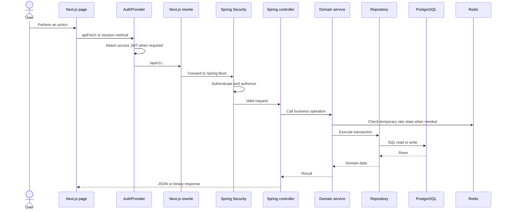
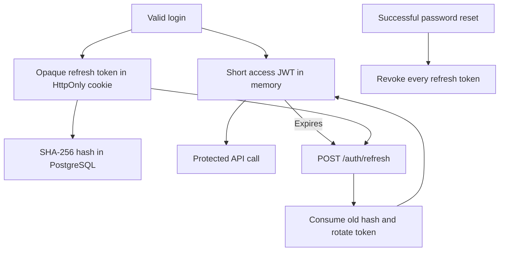

# ENAcademy Swagger and API teaching guide

This standalone guide teaches the API concepts used by ENAcademy and shows how Swagger UI, OpenAPI, Springdoc, Spring Security, validation, tokens, controllers, services, PostgreSQL, Redis, and the Next.js frontend connect. It is written for learning and for practical local debugging.

## 1. What you will learn

After completing this guide, you should be able to:

- explain the difference between an API, REST, HTTP, OpenAPI, Swagger UI, and Springdoc;
- open and read ENAcademy's generated API contract;
- identify public, authenticated-student, owner-only, and administrator operations;
- understand JSON request bodies, response bodies, status codes, and ProblemDetail errors;
- trace a request from a Next.js page to Spring Boot and PostgreSQL;
- explain access JWTs, refresh tokens, email-verification tokens, and password-reset tokens;
- test a safe public operation in Swagger UI;
- test protected operations without weakening Spring Security;
- diagnose common failures such as `400`, `401`, `403`, `404`, and a blank Swagger page;
- add a new API operation using the project's controller-service-repository workflow.

## 2. Quick access

Start the complete local platform:

```bash
./start-app.sh
```

Then use these addresses:

| Tool | Address | Purpose |
| --- | --- | --- |
| Web application | `http://localhost:3000` | Student and administrator interface |
| Swagger UI | `http://localhost:8080/docs` | Human-friendly interactive API documentation |
| Swagger implementation page | `http://localhost:8080/swagger-ui/index.html` | Page to which `/docs` redirects |
| Raw OpenAPI document | `http://localhost:8080/v3/api-docs` | Machine-readable generated contract |
| API readiness | `http://localhost:8080/actuator/health` | Spring health information |
| Mailpit | `http://localhost:8025` | Local verification and reset messages |

`/docs` is the recommended Swagger URL. Springdoc redirects it to `/swagger-ui/index.html`.

## 3. The important terms

| Term | Meaning |
| --- | --- |
| API | A defined way for software components to communicate |
| HTTP | The request/response protocol used between the browser and Spring Boot |
| REST | A resource-oriented style for designing HTTP APIs |
| JSON | The text format used for most ENAcademy request and response bodies |
| Endpoint | One HTTP method and path, such as `POST /api/v1/auth/login` |
| OpenAPI | A standard machine-readable description of HTTP operations and schemas |
| Swagger UI | A browser interface that reads an OpenAPI document |
| Springdoc | The Java library that generates ENAcademy's OpenAPI document from Spring code |
| Controller | The Spring entry point that receives and validates HTTP input |
| Service | The layer containing transactions and business rules |
| Repository | The layer that reads and writes authoritative PostgreSQL data |
| Authentication | Proving which user is making a request |
| Authorization | Deciding what that authenticated user may do |

Swagger is not the API itself. Spring Boot continues to serve the API if Swagger UI is unavailable. Swagger displays the contract, while Spring Security and service rules enforce the real behavior.

## 4. How Swagger is connected

The dependency is declared in `backend/pom.xml`:

```xml
<dependency>
  <groupId>org.springdoc</groupId>
  <artifactId>springdoc-openapi-starter-webmvc-ui</artifactId>
</dependency>
```

The friendly path is configured in `backend/src/main/resources/application.yml`:

```yaml
springdoc:
  swagger-ui.path: /docs
```

Springdoc examines:

- `@RestController` and controller base paths;
- `@GetMapping`, `@PostMapping`, and `@PatchMapping` methods;
- request and response Java records;
- path variables, query parameters, cookies, and request bodies;
- Jakarta Validation rules such as `@NotBlank`, `@Email`, `@Size`, `@Min`, and `@Max`.

Spring Security permits the documentation resources:

```text
/docs
/docs/**
/swagger-ui.html
/swagger-ui/**
/v3/api-docs/**
```

The Swagger UI needs both its HTML page and its JavaScript/CSS resources. Permitting only `/docs` is insufficient because `/docs` redirects to `/swagger-ui/index.html`.

```mermaid
flowchart LR
    Browser[Browser opens /docs] --> Redirect[302 redirect]
    Redirect --> UI[/swagger-ui/index.html]
    UI --> Assets[Swagger JavaScript and CSS]
    Assets --> Contract[/v3/api-docs]
    Contract --> Controllers[Spring controller metadata]
    Controllers --> Screen[Interactive endpoint documentation]
```

## 5. Anatomy of an HTTP request

An HTTP request can contain:

1. a method;
2. a path;
3. headers;
4. optional path or query values;
5. an optional body.

Example login request:

```http
POST /api/v1/auth/login HTTP/1.1
Host: localhost:8080
Content-Type: application/json

{
  "email": "student@example.test",
  "password": "ExamplePass2026"
}
```

The response contains a status, headers, and usually a body:

```http
HTTP/1.1 200 OK
Content-Type: application/json
Set-Cookie: enacademy_refresh=...; HttpOnly; SameSite=Strict

{
  "accessToken": "...",
  "expiresIn": 900,
  "user": {
    "role": "STUDENT",
    "status": "APPROVED"
  }
}
```

Never place real production passwords or tokens in documentation, screenshots, Git commits, or shared command history.

## 6. HTTP methods used by ENAcademy

| Method | Intended use | Examples |
| --- | --- | --- |
| `GET` | Read data without changing business state | Curriculum, dashboard, products, invoices list, exams |
| `POST` | Create something or execute a command | Register, login, purchase, start exam, submit exam |
| `PATCH` | Partially update existing state | Save words, save exam answers, update student status |
| `DELETE` | Remove a resource | Not currently part of the public application API |

A method communicates intent but does not enforce correctness by itself. The service transaction is authoritative.

## 7. Status codes and their meaning

| Status | Meaning in this project | Example |
| --- | --- | --- |
| `200 OK` | Successful read or command | Login, dashboard, reset password |
| `201 Created` | A new resource was created | Student registration |
| `204 No Content` | Success with no body | Some logout-style operations may use this pattern |
| `302 Found` | Browser redirect | `/docs` redirects to Swagger UI |
| `400 Bad Request` | Invalid input, expired token, or invalid state | Reused password-reset token |
| `401 Unauthorized` | Missing, expired, or invalid authentication | Protected operation without a valid JWT |
| `403 Forbidden` | Identity is known but access is not allowed | Student calls an ADMIN operation |
| `404 Not Found` | Route or requested resource does not exist | Unknown lesson or incorrect URL |
| `409 Conflict` | Request conflicts with current state | Registering an existing email |
| `429 Too Many Requests` | Rate limit rejected the request | Repeated login or recovery attempts |
| `500 Internal Server Error` | Unexpected server failure | Safe ProblemDetail plus a request ID |

`401` and `403` are different. `401` asks for valid authentication; `403` means the authenticated identity lacks permission or the account state forbids the action.

## 8. ENAcademy ProblemDetail errors

Spring converts expected failures into structured ProblemDetail JSON:

```json
{
  "type": "https://enacademy.dev/problems/validation_failed",
  "title": "Validation failed",
  "status": 400,
  "detail": "Check the highlighted fields and try again.",
  "code": "VALIDATION_FAILED",
  "requestId": "correlation-id",
  "errors": {
    "email": "must be a well-formed email address"
  }
}
```

Important fields:

- `status` is the HTTP category;
- `code` is the stable application identifier;
- `detail` is a safe human-readable explanation;
- `errors` maps validation failures to input names;
- `requestId` connects the browser failure to structured backend logs.

Frontend code should prefer stable `code` and field names rather than parsing English sentences.

## 9. Request path through the platform



The browser normally calls relative `/api/v1/...` addresses on port `3000`. `frontend/next.config.ts` rewrites them to the Spring backend. Swagger talks directly to Spring on port `8080`.

## 10. Authentication and token lifecycle

### Access JWT

- Returned after successful login or refresh.
- Stored only in frontend memory.
- Sent as `Authorization: Bearer <token>`.
- Short lifetime: 15 minutes by default.
- Contains identity claims such as user ID and role.
- Signed with `JWT_SECRET`; it is not encrypted storage.

### Refresh token

- A random opaque value stored in an HttpOnly cookie.
- JavaScript cannot read the cookie.
- Only a SHA-256 hash is stored in PostgreSQL.
- Rotated when `/auth/refresh` succeeds.
- Revoked at logout, suspension-sensitive flows, and successful password reset.

### Email-verification token

- Generated from 32 secure random bytes.
- Raw value appears only in the email link.
- SHA-256 hash is stored in PostgreSQL.
- Expires after 24 hours and is single-use.

### Password-reset token

- Generated from 32 secure random bytes.
- Raw value appears only in the recovery email.
- SHA-256 hash is stored in PostgreSQL.
- Expires after 60 minutes by default.
- Is consumed once; reuse returns `400`.
- Successful reset stores a new BCrypt cost-12 password hash and revokes refresh sessions.



Theme design tokens are unrelated to authentication tokens. CSS variables control appearance; JWTs and opaque tokens control identity and recovery.

## 11. API authorization groups

### Public operations

- account registration;
- email verification and resend;
- password-reset request and completion;
- login, refresh, and logout;
- public curriculum summary;
- Swagger/OpenAPI documentation;
- health readiness endpoints.

### Approved student operations

- dashboard and progress;
- lesson content and completion;
- saved words;
- store, purchases, owned invoices, and owned books;
- entitled exams, answer saving, and submission.

### Ownership rules

A student JWT does not grant access to every student's records. Services compare the authenticated user ID with purchase, invoice, attempt, or progress ownership.

### Administrator operations

Paths under `/api/v1/admin/**` require the `ADMIN` role. The UI hiding an admin link is not a security control; Spring Security is the control.

## 12. Current endpoint catalog

All application endpoints use the `/api/v1` base path.

### Authentication

| Method | Path | Purpose |
| --- | --- | --- |
| `POST` | `/auth/register` | Create a pending student |
| `POST` | `/auth/verify` | Consume an email-verification token |
| `POST` | `/auth/verification/resend` | Send a fresh verification link when appropriate |
| `POST` | `/auth/password/forgot` | Request a neutral-response reset email |
| `POST` | `/auth/password/reset` | Consume reset token and replace password |
| `POST` | `/auth/login` | Authenticate and create a session |
| `POST` | `/auth/refresh` | Rotate refresh token and return a new JWT |
| `POST` | `/auth/logout` | Revoke refresh token and expire cookie |
| `GET` | `/auth/me` | Return the authenticated user |

### Learning

| Method | Path | Purpose |
| --- | --- | --- |
| `GET` | `/learning/curriculum` | Public curriculum summary |
| `GET` | `/learning/dashboard` | Progress, saved words, XP, and entitlements |
| `GET` | `/learning/lessons/{slug}` | Lesson content and unlock state |
| `POST` | `/learning/lessons/{slug}/complete` | Persist completion score and XP |
| `GET` | `/learning/words` | List saved words |
| `PATCH` | `/learning/words` | Save or remove one word |

### Store

| Method | Path | Purpose |
| --- | --- | --- |
| `GET` | `/store/products` | Catalog plus ownership state |
| `POST` | `/store/purchases` | Approve beta purchase and grant entitlement |
| `GET` | `/store/purchases` | Student order and invoice history |
| `GET` | `/store/invoices/{invoiceId}/pdf` | Download an owned Persian invoice |
| `GET` | `/store/books/{productId}/download` | Download an owned book |

### Exams

| Method | Path | Purpose |
| --- | --- | --- |
| `GET` | `/exams` | List entitled exams and attempt state |
| `POST` | `/exams/{slug}/attempts` | Start or resume the student's attempt |
| `GET` | `/exams/attempts/{attemptId}` | Resume attempt and obtain server time |
| `PATCH` | `/exams/attempts/{attemptId}/answers` | Batch-save changed answers |
| `POST` | `/exams/attempts/{attemptId}/submit` | Submit, grade, and return review |

### Administration

| Method | Path | Purpose |
| --- | --- | --- |
| `GET` | `/admin/students` | Student metrics and approval queue |
| `PATCH` | `/admin/students/{id}/status` | Approve, reject, suspend, or restore student |
| `GET` | `/admin/audit` | Recent audit records |
| `GET` | `/admin/commerce` | Commerce operations overview |
| `PATCH` | `/admin/commerce/products/{productId}` | Change price or availability |
| `GET` | `/admin/commerce/invoices/{invoiceId}/pdf` | Download any invoice as admin |
| `GET` | `/admin/exams` | Exam schedule and attempt metrics |
| `PATCH` | `/admin/exams/{examId}` | Change exam publication and schedule |

Swagger's generated contract is the best source for exact schemas. This catalog explains business purpose.

## 13. Using Swagger UI safely

### Inspect a public operation

1. Open `http://localhost:8080/docs`.
2. Find `GET /api/v1/learning/curriculum`.
3. Expand it.
4. Read the response schema.
5. Select **Try it out**.
6. Select **Execute**.
7. Confirm a `200` response and compare it with the curriculum page.

### Inspect validation without creating an account

Expand `POST /api/v1/auth/register` and study its schema:

- name length: 2–120;
- valid email, maximum 320 characters;
- password length: 10–72;
- uppercase, lowercase, and number required.

Do not execute account creation unless you intentionally want a new local database record and verification email.

### Current protected-operation limitation

The generated OpenAPI document does not currently declare a bearer `securityScheme`, so Swagger UI does not show a global **Authorize** button. Protected operations remain correctly enforced but are easier to test through the web application, Playwright, or a local HTTP client.

Adding an OpenAPI bearer scheme in the future would improve Swagger usability. It would not replace Spring Security.

## 14. Calling the API from a terminal

Public curriculum request:

```bash
curl -i http://localhost:8080/api/v1/learning/curriculum
```

Login request:

```bash
curl -i \
  -H 'Content-Type: application/json' \
  -d '{"email":"<local-email>","password":"<local-password>"}' \
  http://localhost:8080/api/v1/auth/login
```

For a temporary local access token:

```bash
ENACADEMY_ACCESS_TOKEN='<paste-local-token>'

curl -i \
  -H "Authorization: Bearer ${ENACADEMY_ACCESS_TOKEN}" \
  http://localhost:8080/api/v1/learning/dashboard

unset ENACADEMY_ACCESS_TOKEN
```

Use only disposable local credentials in learning exercises. Shell history, terminal recordings, screenshots, and CI logs can expose pasted secrets.

## 15. JSON, DTOs, and validation

Spring request records define the accepted JSON shape. For example, registration requires `fullName`, `email`, and `password`. Unknown frontend fields do not create database columns.

Validation happens before the controller service call. This protects the service from malformed input, but service rules are still required for business state such as:

- email already registered;
- account not verified or approved;
- lesson still locked;
- product inactive;
- invoice owned by another user;
- exam outside its schedule;
- attempt already submitted.

Validation answers “is this input structurally acceptable?” Business logic answers “is this operation allowed now?”

## 16. Binary API responses

Most operations return JSON. Invoice and book endpoints return PDF bytes.

The frontend therefore has two shared paths:

- `apiFetch` for JSON;
- `apiDownload` for `Blob` responses such as books and invoices.

Trying to parse a PDF response as JSON would fail even when the server returned `200`.

## 17. API versioning

The `/api/v1` prefix provides a contract boundary. It does not mean every internal code edit requires `/v2`.

Usually compatible within `v1`:

- adding an optional response field;
- adding a new endpoint;
- improving implementation without changing the contract.

Potentially breaking:

- removing or renaming a required field;
- changing field meaning or type;
- changing authentication expectations;
- changing a status code clients rely on.

A future `/api/v2` should be introduced deliberately when incompatible behavior must coexist with `v1`.

## 18. How to add a new API operation

Use this workflow:

1. Define the user outcome and authorization rule.
2. Choose the method and resource path.
3. Define validated request and response records.
4. Add the controller entry point.
5. Put business rules and transaction boundaries in the service.
6. Put SQL and row mapping in the repository.
7. Add or update a Flyway migration if persistence changes.
8. Add Spring Security rules if the path has a new access category.
9. Connect the frontend through `AuthProvider`, `apiFetch`, or `apiDownload`.
10. Add backend tests and a browser test when it affects a user journey.
11. Open Swagger and verify the generated schema.
12. Update this guide and the system guide.

```mermaid
flowchart LR
    Requirement --> Contract[Method, path, request, response]
    Contract --> Security[Authentication and authorization]
    Security --> Controller
    Controller --> Service
    Service --> Repository
    Repository --> Migration[Flyway when needed]
    Migration --> Tests
    Tests --> Swagger[Inspect generated OpenAPI]
    Swagger --> Docs[Update teaching documentation]
```



Do not place database access directly in a controller or trust a role sent by the browser.

## 19. Testing the API

ENAcademy uses several complementary test layers:

| Test | Proves |
| --- | --- |
| Java unit/integration tests | Service rules, hashing, PDF output, migrations, and PostgreSQL behavior |
| Frontend Node tests | Source-level UI, validation, theme, and integration regressions |
| TypeScript and ESLint | Type and code-quality constraints |
| Playwright | Real browser journeys through Next.js, Spring, PostgreSQL, Redis, and Mailpit |
| Exam load test | Concurrent start, autosave, resume, and submission capacity |
| Swagger/OpenAPI check | Documentation UI and generated contract are reachable |

Swagger is an exploration tool, not a complete automated test suite.

## 20. Troubleshooting Swagger

### `/docs` returns a redirect

This is expected. It redirects to `/swagger-ui/index.html`.

### Swagger page returns `401`

Check that Spring Security permits all of:

```text
/docs
/docs/**
/swagger-ui.html
/swagger-ui/**
/v3/api-docs/**
```

The UI route and raw OpenAPI route are separate resources.

### The page is blank but `/v3/api-docs` works

Likely causes include:

- Swagger JavaScript or CSS blocked by Spring Security;
- stale browser cache after a backend rebuild;
- a content-security rule added without allowing required self-hosted assets;
- the backend container still running an old image.

Rebuild and restart the backend, then reload:

```bash
docker compose up -d --build backend
```

### Connection refused

The backend is not listening on port `8080`. Check:

```bash
docker compose ps
docker compose logs backend
```

### `/v3/api-docs` returns JSON but an operation is missing

Check that the controller is discovered by Spring, uses mapping annotations, and is part of the running image. Rebuild after code changes.

### Protected operation returns `401`

The request lacks a valid bearer JWT or refresh context. Public Swagger access does not make application endpoints public.

### Protected operation returns `403`

The user is authenticated but has the wrong role, wrong ownership, or disallowed account state.

## 21. Security and production notes

The local project exposes Swagger publicly for learning and development. For production, choose deliberately whether documentation should be:

- disabled;
- available only inside an internal network;
- protected by operator authentication;
- published as a separate reviewed contract.

Never rely on hiding Swagger as the primary API security mechanism. Every operation must still enforce authentication, role, ownership, validation, rate limits, and business state.

Avoid placing examples containing:

- real passwords;
- access or refresh tokens;
- password-reset or verification links;
- PostgreSQL or SMTP credentials;
- private user records.

## 22. Guided exercises

### Exercise 1: read a public operation

Find the curriculum endpoint and identify its method, path, response status, and top-level schema.

### Exercise 2: compare code and contract

Find `AuthController.login`, then locate the corresponding Swagger operation and its request/response records.

### Exercise 3: classify access

Group five endpoints into public, approved student, owner-only, and ADMIN categories.

### Exercise 4: inspect validation

Find the registration password constraints in Swagger, then locate the Jakarta Validation annotations that generated them.

### Exercise 5: trace one request

Trace lesson completion from the browser button through `AuthProvider`, the Next.js rewrite, Spring Security, `LearningController`, `LearningService`, `LearningRepository`, and PostgreSQL.

### Exercise 6: explain one error

Describe the difference between an invalid request (`400`), missing authentication (`401`), and insufficient authorization (`403`).

### Exercise 7: design an endpoint

Design—but do not implement—an endpoint for downloading a student's exam result. Choose its method, path, ownership rule, response type, and failure codes.

## 23. Review questions

1. Why is Swagger UI not the same thing as the API?
2. Why does `/docs` need `/swagger-ui/**` to be permitted?
3. Which component creates the OpenAPI JSON?
4. Where is an access JWT stored in the frontend?
5. Why is the refresh token stored as a database hash?
6. What is the difference between validation and a business rule?
7. Why does an invoice download use `apiDownload` rather than `apiFetch`?
8. Why can a student receive `403` even with a valid JWT?
9. When would a new API version be justified?
10. Which tests prove more than Swagger can prove?

## 24. Source map

| Topic | Main source |
| --- | --- |
| Springdoc dependency | `backend/pom.xml` |
| Swagger path and API configuration | `backend/src/main/resources/application.yml` |
| Public and protected paths | `backend/src/main/java/com/enacademy/config/SecurityConfig.java` |
| Authentication API | `backend/src/main/java/com/enacademy/auth/AuthController.java` |
| Learning API | `backend/src/main/java/com/enacademy/learning/LearningController.java` |
| Commerce API | `backend/src/main/java/com/enacademy/commerce/CommerceController.java` |
| Exam API | `backend/src/main/java/com/enacademy/exam/ExamController.java` |
| Administrator APIs | `backend/src/main/java/com/enacademy/admin` and domain admin controllers |
| Error contract | `backend/src/main/java/com/enacademy/shared/ApiExceptionHandler.java` |
| Shared browser API client | `frontend/components/AuthProvider.tsx` |
| Next.js API rewrite | `frontend/next.config.ts` |
| Full browser workflow | `frontend/e2e/platform-workflows.spec.mjs` |
| Complete architecture | `docs/system-guide.md` |

## 25. Glossary

- **Bearer token:** a credential accepted from whoever possesses it.
- **Contract:** the documented input/output behavior clients depend upon.
- **DTO:** a request or response object used to transfer data across a boundary.
- **Idempotent:** repeated equivalent requests produce the same intended final state.
- **Opaque token:** a random value with no client-readable claims.
- **Schema:** the documented structure and constraints of a value.
- **Serialization:** converting Java/TypeScript data to JSON or bytes.
- **Trust boundary:** a point where input must be authenticated, authorized, and validated.

Update this guide whenever the API base path, authentication model, Springdoc configuration, endpoint catalog, error contract, or Swagger access policy changes.
